# C# Basics

Status: **In progress**

> **How to read this file:** every abbreviation is spelled out in full the first time it's used. Blockquotes labeled **New term** explain foundational concepts from scratch — value types, reference types, boxing, the stack/heap, the garbage collector, and more. You shouldn't need to look anything up elsewhere. Everything else (diagrams, tables, interview traps) still aims at senior-level interview depth — it's just self-contained now.

---

## 1. The .NET Landscape

> **New term — .NET.** ".NET" is a *platform* for building software. It bundles three things together:
> - A **runtime** that executes your compiled code.
> - A **standard library** of reusable code — file access, networking, collections, and more — so you don't write everything from scratch.
> - **Compilers** (for C#, F#, VB.NET) that turn your source code into a form the runtime can run.
>
> ".NET Framework," ".NET Core," and ".NET 5+" below are different historical versions of this same idea.

You need the history because interviewers use it to check you understand *why* things are the way they are today.

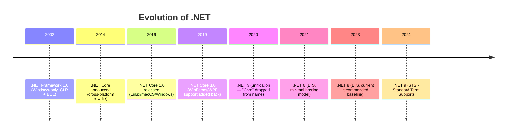

| | .NET Framework | .NET Core (legacy name) | .NET 5+ (current) | Mono / Xamarin |
|---|---|---|---|---|
| Platform | Windows only | Cross-platform | Cross-platform | Cross-platform (mobile/game engines) |
| Status | Maintenance mode only, no new features | Superseded by .NET 5+ | Actively developed | Used inside .NET MAUI, Unity |
| Open source | Partially | Yes | Yes | Yes |
| Use today | Legacy WebForms/WCF apps | — | All new development | Mobile apps via .NET MAUI |

Acronym key for the table/timeline above — these are just history/context, not things you need to use day-to-day:
- **WinForms** = Windows Forms, **WPF** = Windows Presentation Foundation — two older frameworks for building Windows desktop UIs.
- **WCF** = Windows Communication Foundation, an older framework for building network services. It's superseded today by REST-style **APIs** (Application Programming Interfaces — see [[19-API-Design-Best-Practices]]).
- **MAUI** = Multi-platform App UI, Microsoft's current cross-platform mobile/desktop UI framework.

**Key interview point:** .NET Core wasn't "a faster .NET Framework" — it was a ground-up rewrite. Three things drove that rewrite: cross-platform support, modularity, and performance. Modularity here means **NuGet** packages instead of one giant BCL — NuGet is .NET's package manager, a way to download and reuse other developers' pre-built code libraries, similar to npm for JavaScript or pip for Python.

.NET 5 renamed "Core" away once feature parity was reached, so "which .NET are you on" today just means the version number (8, 9, ...). .NET 8 is the current **LTS** release — **LTS** (Long Term Support) means Microsoft commits to 3 years of updates and bug fixes. Pick .NET 8 by default for production unless you specifically need a newer preview feature.

- **CLR** (Common Language Runtime) = the virtual machine that executes .NET code. It's responsible for:
  - **GC** (Garbage Collector) — automatic memory cleanup, explained in section 3.
  - **JIT** (Just-In-Time compiler) — explained in section 2.
  - Type safety and exception handling.

  > **New term — Virtual machine (in this context).** Not "a VM you'd spin up in the cloud." Here it means a software layer that sits between your compiled code and the real CPU. That layer is what lets the same compiled output run unmodified on different physical machines and operating systems. The CLR reads your program's instructions (IL, see section 2) and executes them itself — managing memory and safety along the way — instead of your code talking to the hardware directly.

- **BCL** (Base Class Library) = `System.*` — collections, file I/O, threading, etc. This is the "standard library" mentioned above: code Microsoft already wrote so you don't reinvent lists, file readers, etc.
- **CLI** (Common Language Infrastructure) is the **ECMA** (Ecma International, a European standards organization) standard that defines the CIL/metadata format so multiple languages — C#, F#, VB.NET — can interoperate. This is *why* a C# `List<T>` and an F# equivalent can call into each other seamlessly.

  Don't confuse this CLI with the far more common meaning, Command Line Interface — they're unrelated acronyms that happen to collide.

  **CIL** (Common Intermediate Language) is the formal standards name for what's usually just called **IL** (Intermediate Language). They're the same thing: CIL is the term used when talking about the standard itself, IL is the term used in everyday tooling.

---

## 2. Compilation Pipeline: Source → IL → Native

This is one of the most commonly probed "do you actually understand the runtime" questions.

> **New term — Compiler.** A compiler is a program that translates the code you write (source code) into another, lower-level form. C#'s compiler doesn't go straight to the machine code your CPU understands — it deliberately stops one step short, at IL, explained in the first bullet below.

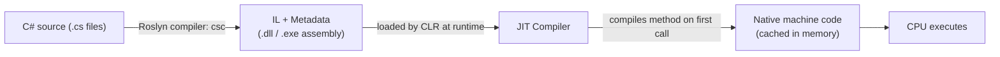

- **Roslyn** is the modern open-source C# compiler. It converts your C# code into **IL** (Intermediate Language), not directly into machine code. IL is a low-level, CPU-independent instruction set — not the actual machine code your processor runs.

  This is why the same DLL runs on Windows/Linux/macOS/ARM/x64: the IL is platform-agnostic. **ARM** and **x64** are examples of CPU **architectures** — families of processor designs with different native instruction sets. Code compiled for one won't run on the other without translation, which is exactly what shipping IL instead of native code avoids needing.

- **JIT** (Just-In-Time compilation) happens per method, the first time that method is called. It translates the method's IL into real native machine code for the CPU you're actually running on, and the result is cached for the process's lifetime. This is why the *first* call to a method is often slower — sometimes called "JIT warm-up" — which matters for cold-start discussions around serverless/Azure Functions.
- **Tiered compilation** (default since .NET Core 3) balances startup time against peak throughput. Tier 0 JIT is quick-and-dirty, optimized for fast startup. If a method is called often (a "hot path"), it gets recompiled by Tier 1 with full optimizations. The tradeoff is made automatically.
- **ReadyToRun (R2R)** and **Native AOT** both reduce startup time by compiling code before the application runs:
  - **R2R** ships both precompiled native code and IL. If needed, the CLR can still fall back to JIT compilation.
  - **Native AOT** (Ahead-Of-Time compilation) produces only native code — no IL, no JIT at runtime. That gives faster startup, but limits some reflection-heavy scenarios. Native AOT is the modern answer to "why is my container's cold start slow?"

**Common interview question:** *"Is C# compiled or interpreted?"* — Neither, purely. It's a two-stage compiled language: compiled to IL ahead of time, then JIT-compiled to native code at runtime. That's different from Java only in branding — the JVM (Java Virtual Machine) does the same thing conceptually (bytecode + JIT).

---

## 3. Value Types vs Reference Types, Stack vs Heap

This is the single most important mental model for the rest of C#. Get this wrong and async/mutability/performance questions all fall apart.

> **New term — Variable and type.** A **variable** is a named storage location in memory that holds a value. For example, `int x = 5;` creates a variable named `x` holding the value `5`.
>
> Every variable has a **type**. The type tells the compiler two things: how much memory to reserve, and what operations are valid on that data. You can add two `int`s together, but not two `Person`s — unless you explicitly define what "+" means for `Person`.

> **New term — Memory, stack, and heap.** When your program runs, the operating system gives it a chunk of memory — **RAM** (Random Access Memory) — to work with. That memory is split into regions. Two matter here: the stack and the heap.
>
> **The stack** has three defining characteristics:
> - Small and fast.
> - Behaves like a physical stack of plates — **LIFO** (Last In, First Out): the most recently added item is the first one removed.
> - Cleans itself up automatically: when a method is called, its local variables are "pushed" on; when the method returns, they're "popped" off automatically.
>
> That automatic push/pop is why stack allocation is essentially free.
>
> **The heap** is different:
> - Larger and more flexible — used for data that needs to outlive a single method call, or whose size isn't known until runtime.
> - Slower to allocate than the stack.
> - Doesn't clean itself up when a method returns — that's the **Garbage Collector**'s job (below).

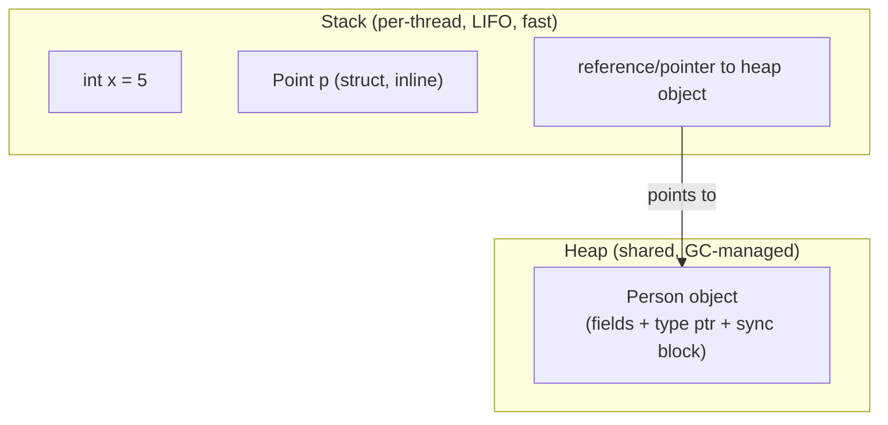

> **New term — Reference (pointer).** A reference is simply an address — a number that says "the real data lives over there in memory." A reference-type variable stores this address, not the data itself. That's true whether the variable lives on the stack or inline inside another heap object.
>
> You never see the raw address in C#. Whenever you use `.` to access a member, C# follows the address to read or modify the real data automatically.

### Stack frames, concretely

Each **thread** gets its own stack (~1MB by default in .NET). It's organized into **frames**, one per method currently in progress. Calling a method pushes a new frame containing its parameters and locals; returning pops the whole frame off in one shot — no per-variable cleanup needed, which is why it's essentially free:

```
Call OrderService.Process()
┌───────────────────────────┐
│ Process() frame            │  ← pushed on call, popped on return
│  int total = 0             │
│  Order order (reference) ──┼──┐
└───────────────────────────┘  │
        stack grows ↑           ▼
                            Heap: Order { Id=7, Items=[...] }
```
`total` lives entirely inside the frame. `order` is also inside the frame, but it's just an address — the actual `Order` object it points to lives on the shared heap, outside any frame, until nothing references it.

Now the core distinction:

| | Value type | Reference type |
|---|---|---|
| Examples | `int`, `double`, `bool`, `struct`, `enum` | `class`, `string`, `array`, `delegate`, interfaces |
| Storage | Typically on the **stack** (or inline inside whatever contains it — see note below) | Always on the **heap**; a reference (pointer) to it lives wherever the variable is declared |
| Assignment (`b = a`) | **Copies** the entire value | Copies the **reference** — both variables point to the same object |
| Default `null`? | No (unless `Nullable<T>`/`T?`) | Yes |
| Passed to methods | By value (a copy) by default | The reference itself is passed by value (so you can mutate the object's fields, but reassigning the parameter doesn't affect the caller's variable — unless you use `ref`) |

### Copy semantics, concretely

> **New term — struct.** `struct` is a C# keyword for defining your own **value type** — a small custom data type made of one or more fields bundled together. For example, `struct Point { public int X, Y; }` creates a type called `Point` that's just an `X` and a `Y` glued into one unit.
>
> A variable of a struct type directly *contains* its fields' data, rather than pointing to it elsewhere. That's exactly why assigning one struct variable to another copies the data instead of sharing a reference. Compare this to `class`, which defines a **reference type** (see the example below). Section 10 covers `struct` vs `class` in full.

```csharp
struct Point { public int X, Y; }

Point p1 = new Point { X = 1, Y = 2 };
Point p2 = p1;        // COPIES all fields into p2's own slot
p2.X = 99;

Console.WriteLine(p1.X); // 1 — p1 is untouched
Console.WriteLine(p2.X); // 99
```
`p1` and `p2` are two entirely separate blobs of memory after that assignment — mutating one can never affect the other. Compare a reference type:

```csharp
class Order { public int Total; }

Order o1 = new Order { Total = 100 };
Order o2 = o1;         // COPIES the address, not the object
o2.Total = 999;

Console.WriteLine(o1.Total); // 999 — same object!
```
`new Order()` allocates the object once, on the heap. `o1` just holds a pointer to it. `o2 = o1` copies *that pointer* — now two variables point at the same object, so mutating through `o2` is visible through `o1`. This — not magic — is the root cause of the classic bug "I passed my object into a method and it changed my data": the method received the same address, not a copy.

> **Correction to a common oversimplification:** "value types go on the stack, reference types go on the heap" is *approximately* true but not the real rule. The actual rule: **a value type is stored wherever it's declared.** A local variable that's a struct lives on the stack. A struct that is a *field of a class* lives inline inside that class's heap allocation. A struct captured in a closure or boxed lives on the heap too. Reference types are always heap-allocated, and their *reference* (pointer) lives wherever the variable is declared (stack, or inline in another heap object).

### Where that nuance actually bites

```csharp
class Order
{
    public Point Location; // a struct FIELD
}

var order = new Order();                      // one heap allocation, for the Order
order.Location = new Point { X = 1, Y = 2 };   // Point is baked INLINE into that same allocation
```
`Location` never gets its own separate heap allocation — its bytes sit directly inside `Order`'s memory, right alongside `Order`'s other fields. There's exactly **one** heap allocation for `order`, which is actually a performance win (no extra pointer to chase to reach `Location`).

A struct gets pushed onto the heap on its own, separately from where it's declared, when it's:
- **Boxed** — assigned to `object`, `dynamic`, or a non-generic interface (see Boxing/unboxing below).
- **Captured by a lambda/closure** — the compiler generates a hidden class to hold captured variables, so anything captured (value or reference type) rides along inside that heap-allocated closure object.
- An element of a `struct[]` array — arrays are always heap objects, but the structs inside are stored inline *inside* that one array allocation, not boxed individually.

### Boxing/unboxing

> **New term — Boxing / unboxing.** C#'s type system treats everything as ultimately derived from `object` (see section 4). But value types like `int` don't normally have the heap-object wrapper that reference types have.
>
> **Boxing** is the automatic process of wrapping a value type in a temporary heap object so it can be treated as an `object` — for example, when passed somewhere that expects `object`, or stored in an old, non-generic collection. **Unboxing** reverses that: it unwraps the value back into a plain value type. Both operations copy data, and boxing performs a heap allocation — that's the hidden performance cost called out below.

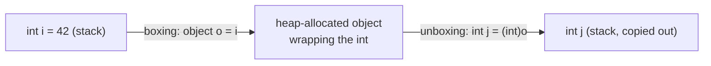
Boxing allocates on the heap and copies the value in; unboxing copies it back out. It's a hidden performance cost — this is why generic collections (`List<T>`) were introduced to replace non-generic ones (`ArrayList`), which boxed every value type stored in them:

```csharp
ArrayList list = new ArrayList(); // pre-generics, non-generic
list.Add(5);            // 5 gets BOXED — a heap allocation just to store one int
list.Add(10);            // another heap allocation

List<int> genericList = new List<int>();
genericList.Add(5);      // NO boxing — List<int> stores raw ints inline in an int[] internally
```
Put 10,000 ints in an `ArrayList` and you've made 10,000 heap allocations — 10,000 extra objects for the GC to eventually track and clean up, just to hold numbers. `List<int>` stores them as a contiguous `int[]`, so there's zero boxing.

Boxing shows up in more places than an explicit `object` assignment. It happens implicitly, and invisibly, anywhere a value type is used through a non-generic interface:

```csharp
interface IShape { double Area(); }

struct Circle : IShape // a struct implementing an interface
{
    public double Radius;
    public double Area() => Math.PI * Radius * Radius;
}

IShape shape = new Circle { Radius = 2 }; // BOXED — Circle is a struct,
                                            // but `shape` is typed as the interface,
                                            // and interface-typed variables are reference types
```
Assigning a struct to a variable of its interface type boxes it. Calling `shape.Area()` runs on the *boxed copy* sitting on the heap, not on any original `Circle` variable you might still have lying around. This is a frequent source of "why didn't my struct's field change" bugs when a boxed struct gets mutated through an interface reference — the mutation lands on the throwaway box, not on the variable you expected.

### Stack vs Heap in one sentence
Stack = fast, automatically reclaimed when a method returns, size-limited (`StackOverflowException` on deep recursion). Heap = flexible size, reclaimed by the **Garbage Collector** (not immediately when a reference goes out of scope — a key misconception to correct), slower to allocate/deallocate.

> **How the GC actually works (brief):** periodically, the GC briefly pauses the program and looks for objects that are still reachable. It starts from a set of known starting points, called "roots" — local variables currently on the stack, static fields, and so on — then follows every reference outward from those roots. Anything it finds is marked as alive; anything it doesn't find is garbage, and its memory gets reclaimed.
>
> This means an object is only freed at the *next* GC pass after it truly becomes unreachable, not the instant a variable goes out of scope. Unlike languages such as C/C++, you never manually free heap memory in C#.

### Generational GC, in more depth

.NET's GC is **generational**. It assumes most objects die young — a request-scoped DTO, a temporary string — and only a few live long, like a cached singleton. Based on that assumption, it splits the heap into generations instead of treating all objects equally:

- **Gen 0** — newly allocated objects. Collected very frequently and very fast (often microseconds), since most Gen 0 objects are already garbage by the time a collection runs.
- **Gen 1** — objects that survived one Gen 0 collection; a buffer between short-lived and long-lived.
- **Gen 2** — long-lived objects (e.g. a static cache). Collected rarely, since a full Gen 2 sweep is the most expensive.

Each collection starts from the **roots** — local variables on every thread's stack, static fields, CPU registers — and walks every reference reachable from them. Everything found gets marked "alive"; everything unmarked *in that generation* gets reclaimed. An object that survives a collection gets **promoted** to the next generation up.

This is *why* allocating tons of short-lived objects in a hot loop — called "allocation pressure" — hurts throughput. It forces more frequent Gen 0 collections. And if some of those objects happen to still be reachable when a collection runs, they get promoted, clogging the more expensive Gen 1/2 collections too.

### Why this model matters beyond trivia

- **Async code**: value types captured by an `async` method get boxed into a compiler-generated heap object — the state machine backing that method. This is part of why `async` methods carry an unavoidable small allocation cost per call (see [[04-Async-Programming]]).
- **Multithreading**: reference types share one object across every variable pointing at it. So two threads holding the same reference are touching the *same* memory — that's the root cause of race conditions. It's also why `lock`/thread-safety matters for shared reference-type state, but not for a `struct`, where each thread holds its own separate copy.
- **Performance-sensitive code**: `Span<T>`, `ref struct`, and `in` parameters (section 7) exist specifically to work with data without triggering extra heap allocations or copies — that only makes sense once this section's model is second nature.

---

## 4. Primitive Types

> **New term — Bits and bytes.** A **bit** is the smallest unit of memory, holding a `0` or `1`. A **byte** is 8 bits.
>
> Numeric types mainly differ in how many bytes they use. More bytes means a bigger range of values, but more memory used per value. For example: `byte` (1 byte / 8 bits) holds 0–255, while `int` (4 bytes / 32 bits) holds roughly ±2.1 billion.

> **New term — Signed vs unsigned.** "Signed" types (`sbyte`, `short`, `int`, `long`) can represent negative numbers — they spend part of their bit range on the sign. "Unsigned" types (`byte`, `ushort`, `uint`, `ulong` — the `u` prefix means unsigned) can only represent zero and positive numbers. In exchange, they get roughly double the positive range, since no bits are spent on the sign.

| Category | Types | Notes |
|---|---|---|
| Integral | `sbyte`, `byte`, `short`, `ushort`, `int`, `uint`, `long`, `ulong`, `nint`/`nuint` | `int` = `System.Int32`, `long` = `System.Int64`. C# keywords are just aliases for BCL structs. |
| Floating point | `float` (32-bit), `double` (64-bit) | Approximate, binary representation — never use for currency. |
| Decimal | `decimal` (128-bit) | Base-10 representation, used for money — trades range/speed for precision. |
| Boolean | `bool` | 1 byte in memory (not 1 bit) despite holding 2 states. |
| Character | `char` | **UTF-16** (Unicode Transformation Format, 16-bit — the encoding scheme .NET uses internally for text) code unit (2 bytes) — a single `char` can't represent all Unicode code points (surrogate pairs for astral characters). |
| Text | `string` | Reference type, **immutable** (see section 6), UTF-16 internally. |
| Object root | `object` | Every type (value or reference) derives from `System.Object`. |

> **New term — Unicode / character encoding.** Computers only store numbers, so representing text requires a system for mapping numbers to characters. **Unicode** is a standard that assigns a unique number — a **code point** — to essentially every character in every writing system.
>
> **UTF-16** is one way of encoding those numbers into actual bytes in memory, using 2-byte units. Most common characters fit in one unit. Some — emoji, rare scripts — need two units combined, called a "surrogate pair."

> Floating point numbers **approximate** real numbers using a binary fraction. Just as `1/3` can't be written exactly in decimal, some ordinary decimal fractions — like `0.1` — can't be represented exactly in binary either. That causes tiny rounding errors. It's why `float`/`double` are wrong for money, and `decimal` (which uses base-10 internally) is right.

**Interview trap:** `int` is a value type but it's still "an object" in the sense that it derives from `object` — this only works because of implicit boxing when you call a method like `.ToString()` or `.Equals()` defined on `object`/overridden in the struct.

### Type conversion
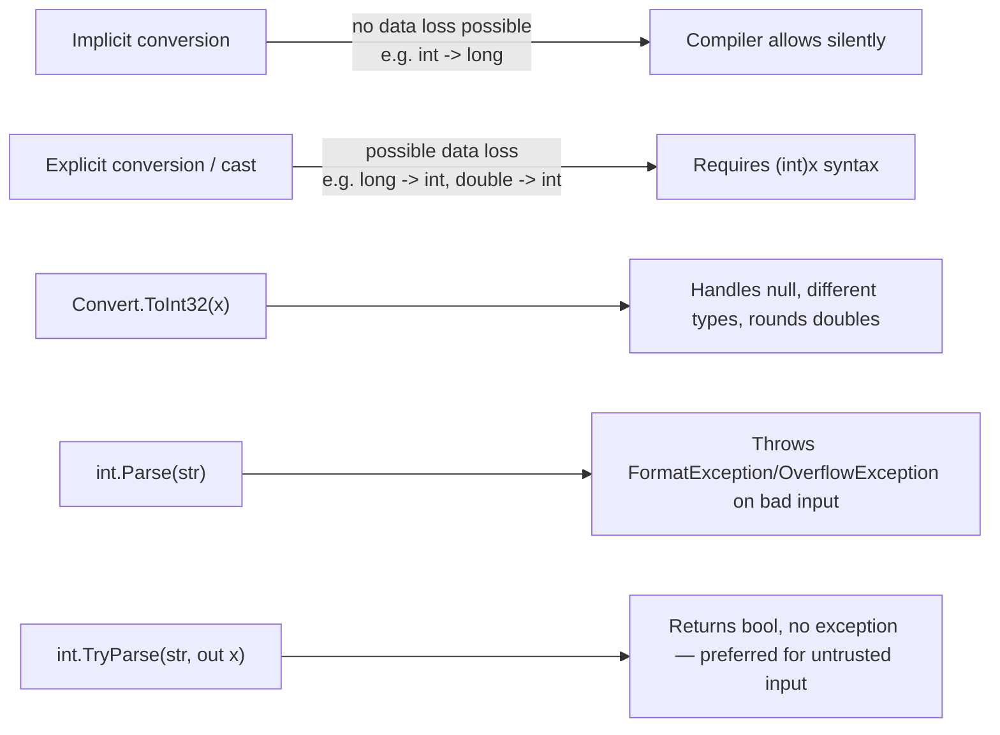
- **Implicit** conversions happen automatically, because no information can be lost — a small type fits inside a bigger one. **Explicit** conversions (casts) require you to write `(int)x`, because information *could* be lost. Writing the cast forces you to acknowledge that risk.
- `Parse` throws on bad input; `TryParse` doesn't. Always prefer `TryParse` for input you don't control — user input, or external **APIs** (Application Programming Interfaces — other programs/services you send requests to and get responses from).
- `Convert.ToInt32(null)` returns `0` (doesn't throw) — a subtle difference from `int.Parse(null)` which throws `ArgumentNullException`. Interviewers sometimes probe this exact difference.

---

## 5. Variables, Operators, Control Flow

Foundational, but still worth spelling out precisely — this is where a lot of small jargon and gotchas live:

- `var` lets the compiler infer a variable's type at compile time from what you assign to it. `var x = 5;` compiles to exactly the same thing as `int x = 5;` — it's just less typing. This is **compile-time type inference**, **not** dynamic typing: `x` is still permanently an `int`, and the compiler rejects `x = "hello";` afterward.

  Compare this to `dynamic`, which defers all type-checking to runtime and bypasses the compiler's safety checks entirely. It's mainly used for interoperating with non-.NET code, or heavy reflection scenarios.

- **Operators** are symbols that perform an operation on values:
  - Arithmetic: `+ - * / %` (`%` is remainder/modulo, e.g. `7 % 3` is `1`).
  - Relational: `== != < > <= >=` — compare two values, produce a `bool`.
  - Logical: `&&` / `||` are **short-circuiting** — `&&` stops evaluating as soon as one side is `false`, since the overall result is already determined; `||` likewise stops once one side is `true`. `&` / `|` always evaluate both sides. They're rarely used on booleans, and mostly seen doing bitwise math on integers instead.
  - Null-conditional `?.` — `person?.Name` evaluates to `null` instead of throwing if `person` is `null`, short-circuiting the rest of the chain.
  - Null-coalescing `??` — `x ?? y` evaluates to `x` if it's not `null`, otherwise `y`.
  - Null-coalescing assignment `??=` — `x ??= y` assigns `y` to `x` only if `x` is currently `null`.

### Null-conditional and null-coalescing operators, in depth

> **New term — `NullReferenceException`.** This is the most common runtime crash in C#. It happens when you use the `.` operator on a variable that's currently `null` — there's no object there to look up a member on. `person.Name` throws this if `person` is `null`. Before `?.` existed, avoiding it meant writing `if (person != null) { ... }` checks everywhere by hand.

```csharp
Person? person = null;

string name = person.Name;   // 💥 throws NullReferenceException
string? name2 = person?.Name; // null — short-circuits instead of crashing
```

`?.` isn't limited to one level — it **chains**. If any link in the chain is `null`, the whole expression short-circuits to `null` immediately, and every `.` after that point is skipped without being evaluated:

```csharp
string? city = order?.Customer?.Address?.City;
```

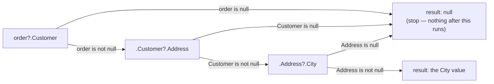

There's also a null-conditional **indexer**, `?[]`, for arrays and collections:

```csharp
int[]? numbers = null;
int? first = numbers?[0]; // null instead of throwing IndexOutOfRange/NullReference
```

And a null-conditional form for invoking delegates safely — historically *the* standard pattern for raising events:

```csharp
// Old pattern: needed a null check first, and even that had a race condition
if (SomethingHappened != null) SomethingHappened(this, EventArgs.Empty);

// Modern pattern: ?. reads the delegate once and short-circuits if it's null
SomethingHappened?.Invoke(this, EventArgs.Empty);
```

`??` (null-coalescing) supplies a fallback value when the left side is `null`:

```csharp
string? name = null;
string displayName = name ?? "Anonymous"; // "Anonymous"

string? name2 = "Alice";
string displayName2 = name2 ?? "Anonymous"; // "Alice" — right side never evaluated
```

Like `&&`/`||` (section 5 above), `??` is **short-circuiting**: the right-hand side only runs if the left side actually turns out to be `null`. That matters when the right side is an expensive call — it won't pay that cost unnecessarily:

```csharp
string name = cachedName ?? GetDefaultName(); // GetDefaultName() only runs if cachedName is null
```

`?.` and `??` combine constantly in real code: chase a possibly-null chain with `?.`, then supply a fallback with `??` if any link along the way turned out to be `null`:

```csharp
string city = order?.Customer?.Address?.City ?? "Unknown";
```

`??=` (null-coalescing assignment, C# 8+) assigns only when the variable is currently `null` — shorthand for the common "initialize if not already set" pattern:

```csharp
List<string>? names = null;
names ??= new List<string>(); // was null → now a new empty list
names.Add("Alice");

names ??= new List<string>(); // NOT null this time → this line does nothing
```

**Interview trap:** `?.` returns a *nullable* result even when the member itself is a non-nullable value type. `int? length = someString?.Length;` — `Length` is normally a plain `int`, but because the whole expression can short-circuit to `null`, the compiler widens the result type to `int?` automatically.
- **`switch` statement vs `switch` expression** — a common "what's new in modern C#" interview question, expanded in [[06-CSharp-Modern-Features]]:
  - `switch` **statement** (classic, C-style): each `case` needs a `break`, or it falls through to the next one. Unlike C/Java, there's no *implicit* fall-through in C# — you must write `goto case` explicitly to opt into it.
  - `switch` **expression** (C# 8+): e.g. `x switch { 1 => "one", _ => "other" }`. It must cover every possible case (be *exhaustive*) or include a `_` discard as a default, and it *returns a value* directly instead of running statements.
- **Loops** repeat a block of code:
  - `for (int i = 0; i < 10; i++) { ... }` — repeats a fixed number of times, tracked with an explicit counter.
  - `foreach (var item in collection) { ... }` — repeats once per element of a collection. It's sugar over calling `.GetEnumerator()` and pulling elements one at a time via `IEnumerable`, the BCL interface that anything "loopable" implements. (In C#, interface names conventionally start with `I`.) See [[03-CSharp-Intermediate]] for iterator internals.
  - `while (condition) { ... }` — repeats as long as `condition` is `true`, checked *before* each iteration (may run zero times).
  - `do { ... } while (condition);` — same as `while`, but checked *after* each iteration (always runs at least once).

---

## 6. Arrays and Strings

### Strings are immutable reference types

> **New term — Immutable.** "Immutable" means an object's data can never change after it's created. Any operation that looks like it modifies the object (`s.Replace(...)`, `s.ToUpper()`) actually leaves the original completely untouched and returns a brand-new object holding the result.

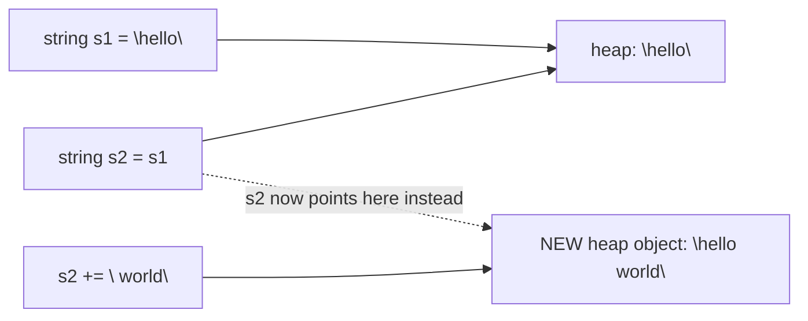
Every "mutation" of a string (`+=`, `.Replace()`, `.ToUpper()`) actually allocates a brand-new string object. `s1` is untouched. This is why concatenating in a loop is a classic performance mistake:

```csharp
// Bad: O(n²) — allocates a new string every iteration
string result = "";
for (int i = 0; i < 10000; i++) result += i;

// Good: StringBuilder mutates an internal buffer in place
var sb = new StringBuilder();
for (int i = 0; i < 10000; i++) sb.Append(i);
string result = sb.ToString();
```

> **New term — Big-O notation.** A shorthand for how an algorithm's cost — time or memory — grows as the input size (`n`) grows, ignoring constant factors.
>
> `O(n²)` ("quadratic") means cost grows roughly with the *square* of `n`: double the input, roughly quadruple the cost. The loop above is `O(n²)` because each of the `n` concatenations has to copy the entire string built so far — itself up to length `n` — for a total of roughly `n × n` character copies.
>
> `O(n)` ("linear," what `StringBuilder` achieves instead) means cost grows proportionally with `n`: double the input, roughly double the cost.

**String interning:** string literals are cached in an intern pool, so `"abc" == "abc"` — two literals — actually reference the *same* heap object. Strings built at runtime (`new string(...)`, concatenation) aren't interned by default, though you can force it with `string.Intern(s)`.

This is why `ReferenceEquals("abc","abc")` can be `true` for literals but `false` for two runtime-built equal strings. `==`/`.Equals`, by contrast, are always `true` for equal content — `string` overloads `==` to do value comparison, unlike the default reference-type behavior.

### Arrays
- Arrays have a fixed size once created, are zero-indexed, and are stored **contiguously** on the heap. (The *elements* might still be value types stored inline, or references for reference-type elements — same rule as section 3.)

  > **Contiguous** means the elements sit one after another in one unbroken block of memory, rather than scattered around. This is what makes indexed access `arr[5]` extremely fast — the runtime just computes `start address + (index × element size)` instead of searching for it.

- `Array` implements `IEnumerable`, `ICollection` — supports `foreach`, `.Length`, `Array.Sort`, `Array.Copy`.
- **Multi-dimensional** (`int[,]`) vs **jagged** (`int[][]`):
  - Multi-dimensional is one contiguous block — every row is the same length.
  - Jagged is an array of arrays — each row can be a different length, and each row is its own separate heap allocation.
  - Jagged is generally faster to iterate, due to better cache locality per row, and is more idiomatic in C#.

```csharp
int[,] grid = new int[3, 3];   // multi-dimensional: one block, all rows same length
int[][] jagged = new int[3][]; // jagged: array of arrays, each row separately allocated
jagged[0] = new int[5];
jagged[1] = new int[2];
```

---

## 7. Methods: Parameters, Overloading

Recall from section 3: value types are copied on assignment/pass, and reference types pass their reference (address) by value. This section covers ways to override that default — i.e. let a method modify the *caller's actual variable*, not a copy of it.

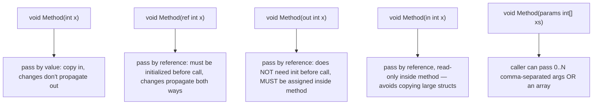

- `ref` vs `out`: both pass the variable's address, not a copy.
  - `ref` requires the caller's variable to already have a value.
  - `out` doesn't require an initial value, but the compiler *forces* you to assign it before the method returns. The classic use is `int.TryParse(s, out int result)`.
- `in` (C# 7.2+) is about **performance**: passing a large `struct` by value copies the whole thing; `in` passes by reference but the compiler prevents mutation, giving you the copy-avoidance of `ref` without the "can this method change my variable" risk.

### `ref`, `out`, `in` — concretely

Recall from section 3: passing an `int` to a method normally passes a **copy**. The method gets its own separate variable, and changes inside it never reach the caller's variable. `ref`, `out`, and `in` all override that default by passing the caller's variable's **address** instead of a copy of its value — the parameter becomes an alias for the exact same storage location.

```csharp
void Increment(ref int x) { x++; }

int a = 5;
Increment(ref a);
Console.WriteLine(a); // 6 — the SAME variable was modified, not a copy
```

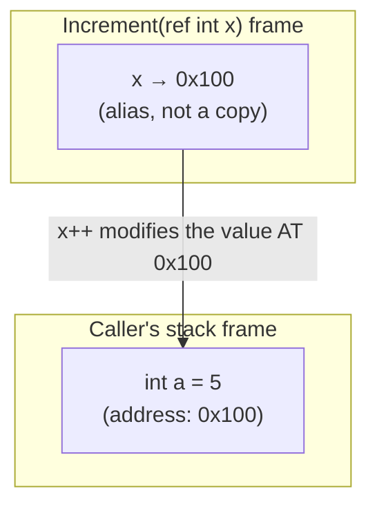

`ref` requires the caller's variable to already hold a value before the call, since the method is free to read it before (optionally) changing it. Classic use: an in-place swap, something that isn't expressible with ordinary by-value parameters:

```csharp
void Swap(ref int x, ref int y)
{
    int temp = x;
    x = y;
    y = temp;
}

int a = 1, b = 2;
Swap(ref a, ref b);
Console.WriteLine($"{a}, {b}"); // 2, 1
```

`out` also passes an address, but the contract is different: the caller's variable does **not** need a value beforehand, and the compiler forces the method to assign it on every code path before returning. This is why `out` is the standard shape for "try this, tell me whether it worked, and give me the result":

```csharp
bool TryParseAge(string input, out int age)
{
    if (int.TryParse(input, out age) && age >= 0)
        return true;

    age = 0; // MUST assign on every path, even the failure path — won't compile otherwise
    return false;
}

if (TryParseAge("42", out int result))
    Console.WriteLine(result); // 42
```
`age` doesn't need a value before the call — declaring it inline at the call site (`out int age`) is legal, unlike `ref`, precisely because the method guarantees it'll be assigned.

`in` (C# 7.2+) also passes an address, but for a different reason entirely: **performance**, not two-way communication. Passing a large `struct` by value copies every one of its fields on every call; `in` avoids that copy by passing the address instead, while the compiler enforces that the method can't modify the caller's data through it:

```csharp
readonly struct Vector3D { public readonly double X, Y, Z; }

double Magnitude(in Vector3D v) // no 24-byte copy on every call
{
    // v.X = 1; // compile error — `in` parameters are read-only
    return Math.Sqrt(v.X * v.X + v.Y * v.Y + v.Z * v.Z);
}
```

| | `ref` | `out` | `in` |
|---|---|---|---|
| Caller must initialize first? | Yes | No | Yes |
| Method must assign before returning? | No | Yes (every path) | No — can't assign at all |
| Can the method modify it? | Yes | Yes | No (read-only) |
| Typical purpose | Two-way mutation (swap, in-place update) | "Try" pattern, multiple return values | Avoid copying a large struct |

**Interview trap:** `ref`/`out`/`in` parameters can't be used inside `async` methods, iterator methods (`yield return`), or lambdas that capture them. All three rely on the compiler generating a state machine or a hidden closure class (section 3) — and a raw stack address can't safely be captured into a heap object that might outlive the stack frame it pointed into.

- **Method overloading**: same method name, different parameter list — count, type, or order. It's resolved at **compile time**, based on the static type of the arguments. That's why overload resolution is unrelated to polymorphism/virtual dispatch, which is a runtime concept — see [[02-OOP-Fundamentals]].
- **Optional parameters** (`void M(int x = 5)`) vs **named arguments** (`M(y: 10, x: 5)`). Optional parameter default values get baked into the *caller's* compiled IL at compile time. That causes a subtle versioning bug: if a library changes a default value, callers compiled against the old library keep using the old default until they're recompiled.

---

## 8. Namespaces, Assemblies, Access Modifiers

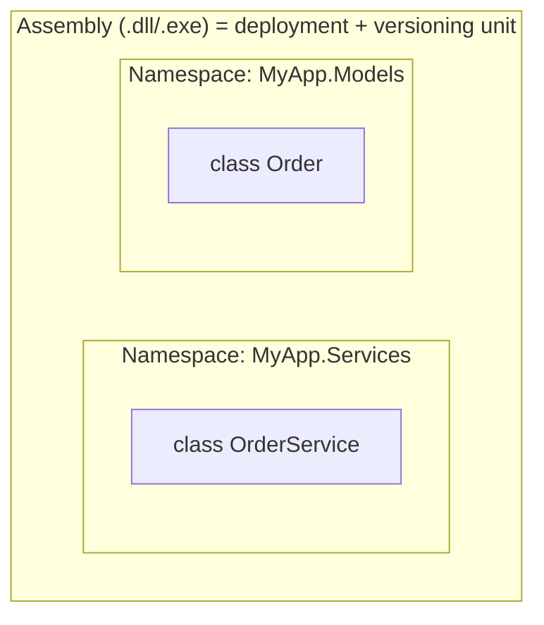

> **New term — DLL / EXE.** **DLL** (Dynamic Link Library) and **EXE** (Executable) are the two file types a .NET assembly compiles to — `.exe` is directly runnable as a standalone program, `.dll` is a library that other programs load and call into. (On Linux/macOS the underlying concept is identical even though the file extensions originated on Windows.)

- **Namespace** = purely a logical, compile-time grouping to avoid name collisions. Has no runtime existence.
- **Assembly** = the physical unit of deployment, versioning, and (historically) security boundary. One assembly can contain many namespaces, and one namespace can span multiple assemblies.
- **Access modifiers**: `public`, `private`, `protected`, `internal`, `protected internal` (union: derived OR same assembly), `private protected` (C# 7.2+, intersection: derived AND same assembly — commonly confused with `protected internal`).

| Modifier | Same class | Derived class, same assembly | Derived class, other assembly | Same assembly, non-derived | Other assembly |
|---|---|---|---|---|---|
| `private` | ✅ | ❌ | ❌ | ❌ | ❌ |
| `protected` | ✅ | ✅ | ✅ | ❌ | ❌ |
| `internal` | ✅ | ✅ | ❌ | ✅ | ❌ |
| `protected internal` | ✅ | ✅ | ✅ | ✅ | ❌ |
| `private protected` | ✅ | ✅ | ❌ | ❌ | ❌ |

### Access modifiers, concretely

> **New term — Encapsulation.** Access modifiers are how C# implements **encapsulation** — restricting which parts of a codebase are allowed to see or touch a given piece of data or code. The general rule of thumb: expose the smallest amount necessary. Start `private`, and only widen access when something outside genuinely needs it.

```csharp
public class BankAccount
{
    private decimal balance; // only THIS class can touch it directly

    public decimal Balance => balance; // controlled read-only access for everyone else

    public void Deposit(decimal amount) // controlled write access, with validation
    {
        if (amount <= 0) throw new ArgumentException("Must be positive");
        balance += amount;
    }
}
```
Without `private` on `balance`, any other code could write `account.balance = -1000;` directly, skipping the validation inside `Deposit`. That's the entire point of encapsulation: force every mutation to go through code that can enforce the class's own rules.

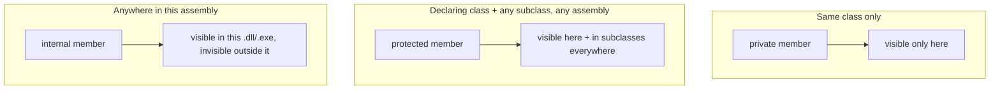

- `private` (the default for class members if you omit a modifier): visible only inside the declaring class itself. Not even a subclass can see it.
- `protected`: visible inside the declaring class **and** any class that inherits from it, no matter which assembly that subclass lives in.
- `internal`: visible anywhere inside the same assembly, but invisible to other assemblies/projects that merely reference it as a library. Useful for implementation details a **NuGet** package wants to share across its own classes without exposing them as public API.
- `protected internal`: the **union** of `protected` and `internal` — visible if *either* condition holds (same assembly, OR a subclass even in a different assembly).
- `private protected` (C# 7.2+): the **intersection** — visible only if *both* conditions hold (must be a subclass, AND in the same assembly). This is the one most often confused with `protected internal` in interviews — the names look almost identical, but the logic (union vs. intersection) is the opposite.

```csharp
public class Base
{
    private int a;             // only Base
    protected int b;           // Base + any subclass, any assembly
    internal int c;            // anywhere in this assembly
    protected internal int d;  // subclass (any assembly) OR same assembly
    private protected int e;   // subclass AND same assembly only
}
```

**Interview trap:** class *members* default to `private` when you omit a modifier, but the `class` declaration itself defaults to `internal` when you omit one: `class Foo { }` is only visible inside its own assembly unless you explicitly write `public class Foo`.

---

## 9. Nullable Value Types

Value types can't normally be `null` (an `int` is always some 32-bit number). `Nullable<T>` (`T?` sugar) wraps a value type to add a `null` state:

> **Why can't a plain value type be `null`?** Because a value type variable *is* its data, stored inline — there's no spare "no value" state hiding inside, say, a 4-byte `int`. `Nullable<T>` fixes this by bundling the value together with an extra `bool` flag that tracks whether it's meaningfully set — effectively `{ bool HasValue; T Value; }`.

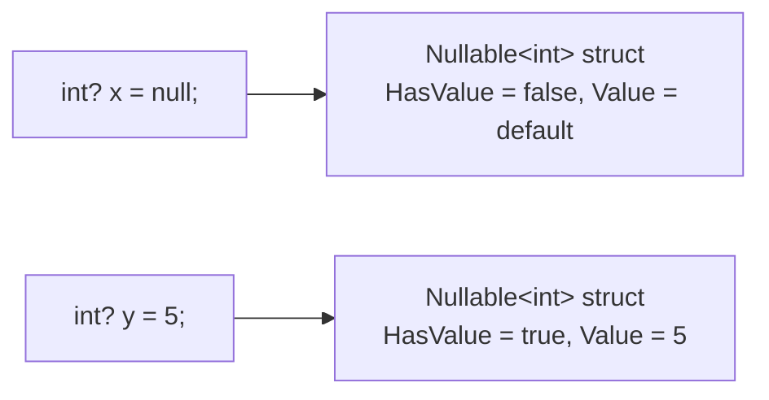

- `int?` is really `System.Nullable<int>`, a struct with `HasValue` (bool) and `Value` (T) fields — it's still a value type overall (unlike Nullable *Reference* Types, which are a compile-time-only annotation feature added in C# 8, covered in [[06-CSharp-Modern-Features]]).
- Accessing `.Value` when `HasValue` is `false` throws `InvalidOperationException` — always check `HasValue` or use `??` (`x ?? 0`) or pattern matching (`x is int val`).

---

## 10. Structs vs Classes (Basics)

| | `struct` | `class` |
|---|---|---|
| Type category | Value type | Reference type |
| Inheritance | Cannot inherit from another struct/class (implicitly seals from further struct inheritance); can implement interfaces | Full inheritance support |
| Default value | All fields zeroed (no constructor call needed) | `null` |
| Typical use | Small, immutable, short-lived data (e.g. `Point`, `DateTime`, `decimal`) | Everything else — entities, services, anything with identity or that needs inheritance |
| Copy semantics | Copied entirely on assignment/pass | Reference copied; underlying object shared |

The official guidelines give a clear rule of thumb: make something a `struct` only if it's small (≲16 bytes as a rough guide), logically immutable, and represents a single value. Otherwise, default to `class`. Getting this wrong — large, mutable structs — causes defensive-copy bugs and performance problems, and is a favorite "what's wrong with this code" interview trap.

---

## 11. Exception Handling Basics

> **New term — Exception.** An exception is an object representing an error or unexpected condition, created ("thrown") at the point something goes wrong. Once thrown, normal execution stops immediately.
>
> Control then jumps upward through whichever methods are currently running — the **call stack**, the chain of "method A called method B called method C…" currently in progress — looking for a `catch` block willing to handle that type of exception. If none is found anywhere up the chain, the program crashes.

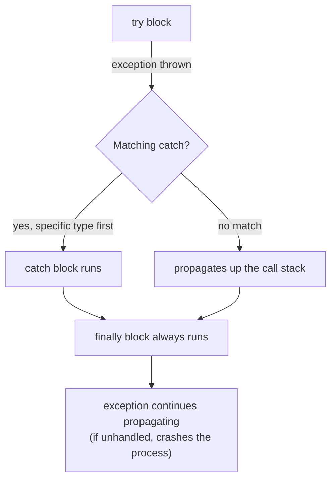

- `try` / `catch` / `finally`: `finally` always executes — whether an exception was thrown, caught, or the method returned normally — used for cleanup (though `using`/`IDisposable` is preferred for resource cleanup specifically, see [[05-CSharp-Advanced]]).
- Catch **most specific exception types first**. A base `catch (Exception ex)` placed before a derived one is unreachable code, and won't even compile in most cases, since the compiler detects order errors for sealed hierarchies. With custom exceptions, though, it can silently swallow more than intended.
- **Custom exceptions**: derive from `Exception` (or a more specific base like `InvalidOperationException`), always provide the three standard constructors (parameterless, message, message+innerException) for consistency with BCL conventions.
- `throw ex;` **resets the stack trace** to the current line — always use bare `throw;` inside a catch block to preserve the original stack trace when rethrowing. This is one of the most common senior-level code review flags.
- Exceptions are for **exceptional/unexpected** conditions, not control flow. Throwing and catching has a real performance cost: **stack unwinding** (the runtime walking back up the call stack looking for a handler, running any `finally` blocks along the way) plus stack trace capture. Using exceptions for expected outcomes — like validation failures — is an anti-pattern. Prefer return values, the Result pattern, or `TryX` methods for expected failure paths instead.

---

## Interview Q&A Cheat Sheet

- **Q: Is C# pass-by-value or pass-by-reference?** — Always pass-by-value by default, including for reference types (the *reference itself* is copied). `ref`/`out`/`in` explicitly pass by reference.
- **Q: Why is `string` immutable?** — Thread-safety (safe to share across threads without locks), enables interning/caching, and safe use as dictionary keys (hash code never changes).
- **Q: What's the difference between `const` and `readonly`?** — `const` is a compile-time constant: its value gets baked into IL at every call site, it must be a primitive/string, and it's implicitly static. `readonly` is a runtime constant: it can be set in the constructor, can depend on runtime computation, and avoids the versioning problem `const` has across assemblies.
- **Q: Stack overflow vs out of memory?** — `StackOverflowException` (uncatchable, crashes process) from deep/infinite recursion exceeding the fixed stack size; `OutOfMemoryException` from exhausting heap space, catchable but usually still fatal in practice.
- **Q: When would you use a struct over a class?** — Small, immutable, frequently-allocated value semantics data where avoiding heap allocation/GC pressure matters (e.g. a `Point` used millions of times in a hot loop).

---

**Next up:** [[02-OOP-Fundamentals]] — say the word when you're ready.
