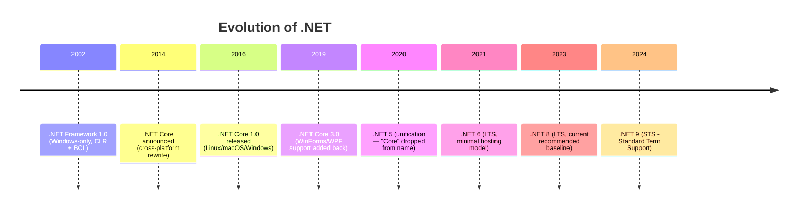
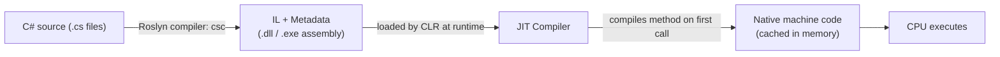
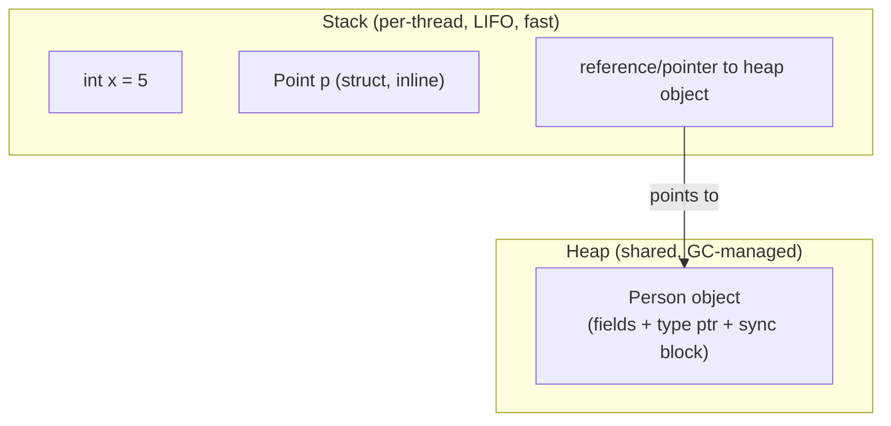
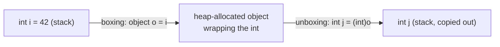
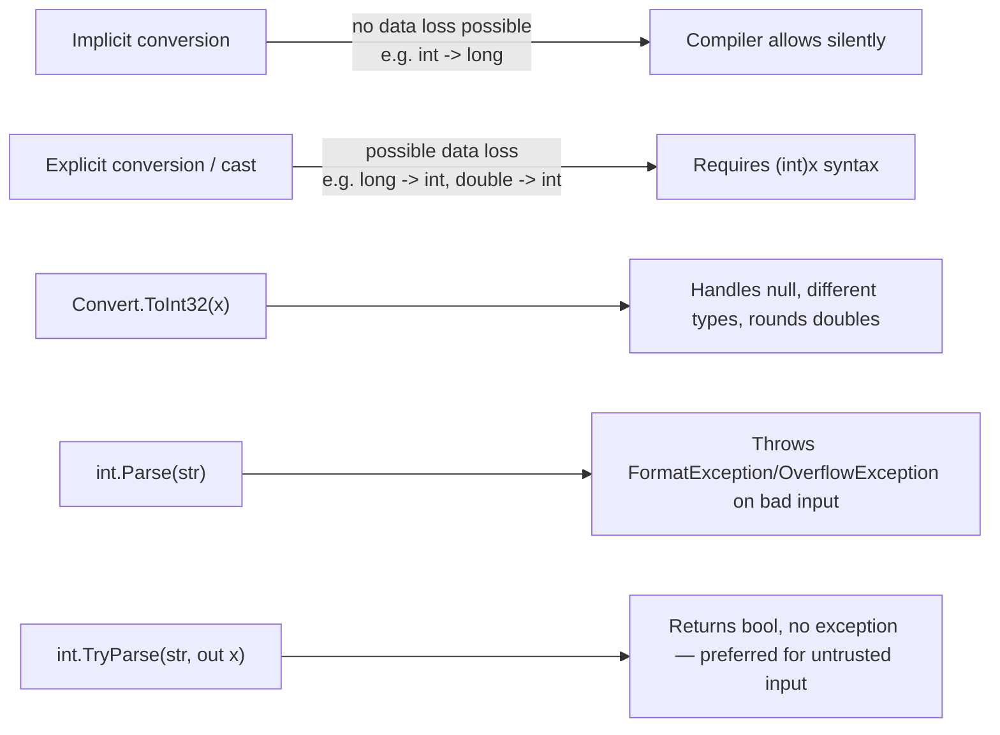
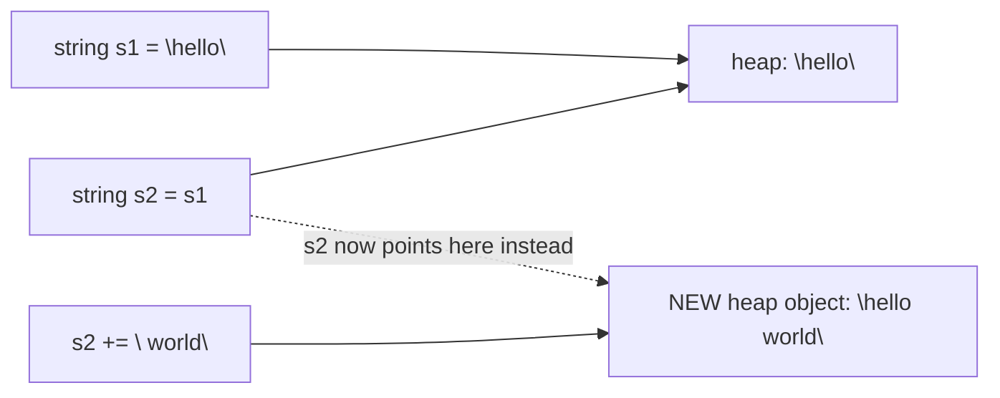
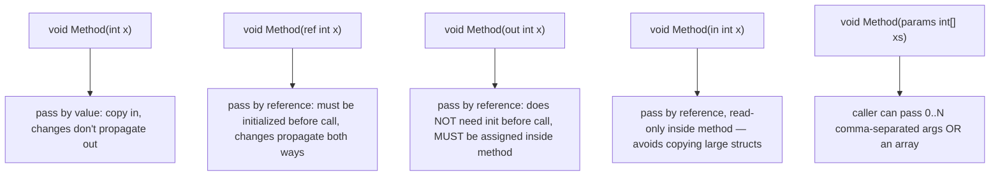
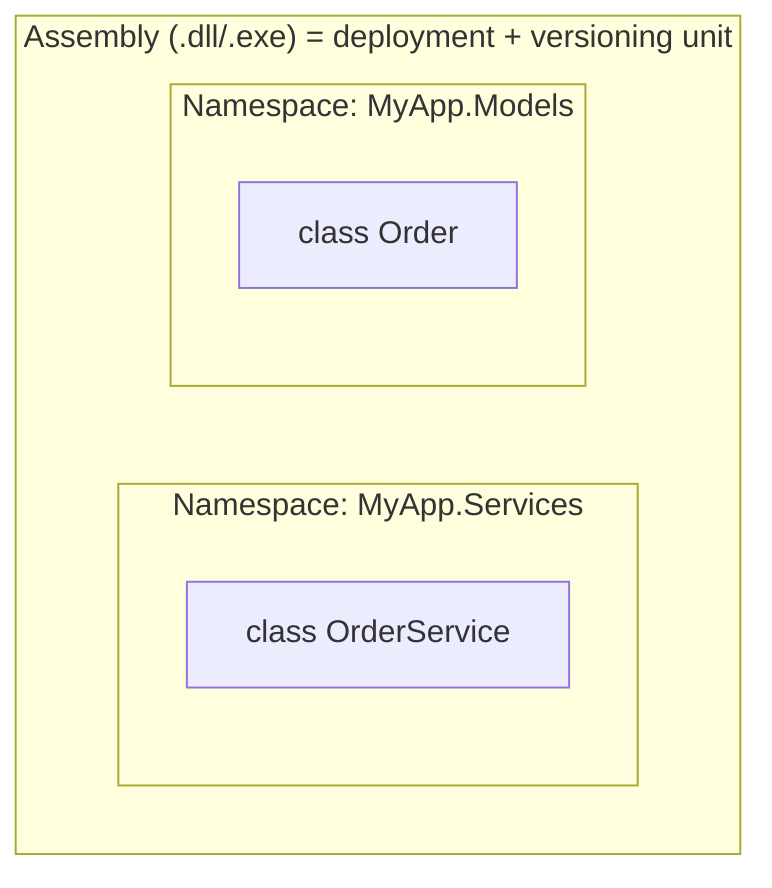
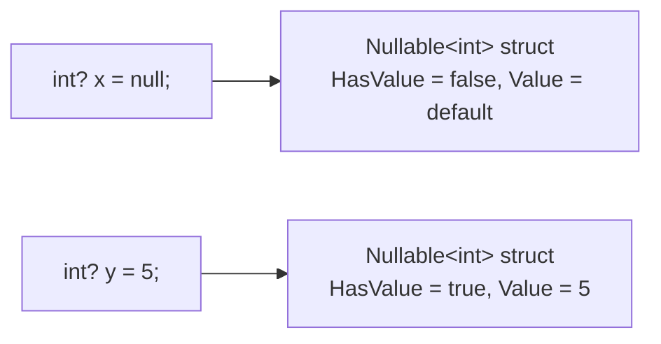
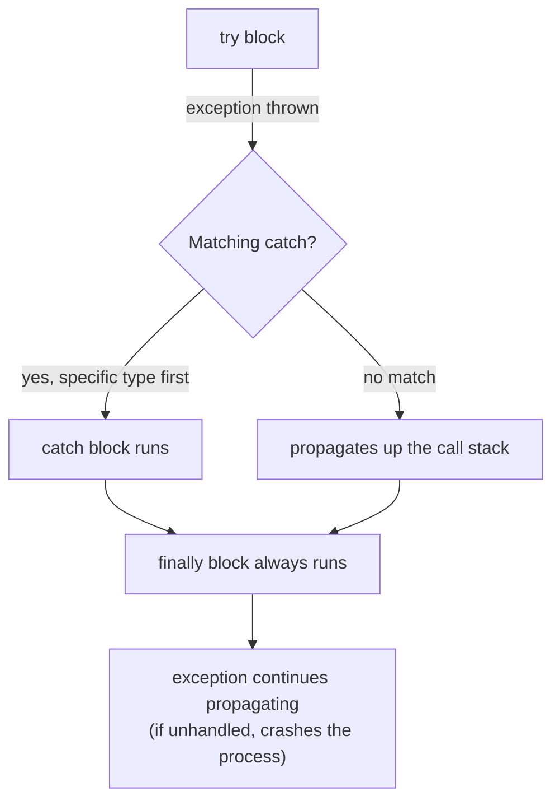

# C# Basics

Status: **In progress**

---

## 1. The .NET Landscape

You need the history because interviewers use it to check you understand *why* things are the way they are today.



| | .NET Framework | .NET Core (legacy name) | .NET 5+ (current) | Mono / Xamarin |
|---|---|---|---|---|
| Platform | Windows only | Cross-platform | Cross-platform | Cross-platform (mobile/game engines) |
| Status | Maintenance mode only, no new features | Superseded by .NET 5+ | Actively developed | Used inside .NET MAUI, Unity |
| Open source | Partially | Yes | Yes | Yes |
| Use today | Legacy WebForms/WCF apps | — | All new development | Mobile apps via .NET MAUI |

**Key interview point:** .NET Core wasn't "a faster .NET Framework" — it was a ground-up rewrite for cross-platform + modularity (NuGet packages instead of one giant BCL) + performance. .NET 5 renamed "Core" away once feature parity was reached, so "which .NET are you on" today just means the version number (8, 9, ...). .NET 8 is the current LTS (3-year support); pick it by default for production unless you specifically need a newer preview feature.

- **CLR** (Common Language Runtime) = the virtual machine that executes .NET code (GC, JIT, type safety, exception handling).
- **BCL** (Base Class Library) = `System.*` — collections, IO, threading, etc.
- **CLI** (Common Language Infrastructure) = the ECMA standard that defines CIL/metadata format so multiple languages (C#, F#, VB.NET) can interoperate — this is *why* a C# `List<T>` and an F# equivalent can call into each other seamlessly.

---

## 2. Compilation Pipeline: Source → IL → Native

This is one of the most commonly probed "do you actually understand the runtime" questions.



- **Roslyn** is the modern open-source C# compiler. It only compiles to **IL (Intermediate Language)**, not machine code. This is why the same DLL runs on Windows/Linux/macOS/ARM/x64 — the IL is platform-agnostic.
- **JIT (Just-In-Time compilation)** happens per-method, the first time a method is called, and the native code is cached for the process's lifetime. This is why the *first* call to a method is often slower ("JIT warm-up") — relevant to cold-start discussions for serverless/Azure Functions.
- **Tiered compilation** (default since .NET Core 3): Tier 0 JIT is quick-and-dirty for fast startup; if a method is called often (hot path), it gets recompiled by Tier 1 with full optimizations. This is a startup-time vs peak-throughput tradeoff made automatically.
- **ReadyToRun (R2R)** and **Native AOT** are ways to skip/reduce JIT at startup by precompiling — R2R still ships IL as fallback + precompiled native code; Native AOT compiles fully ahead-of-time with no JIT and no IL at all (smaller, faster startup, but loses some reflection-heavy features). Native AOT is the modern answer to "why is my container's cold start slow?"

**Common interview question:** *"Is C# compiled or interpreted?"* — Neither, purely. It's a two-stage compiled language: compiled to IL ahead of time, then JIT-compiled to native code at runtime. That's different from Java only in branding — the JVM does the same thing conceptually (bytecode + JIT).

---

## 3. Value Types vs Reference Types, Stack vs Heap

This is the single most important mental model for the rest of C#. Get this wrong and async/mutability/performance questions all fall apart.



| | Value type | Reference type |
|---|---|---|
| Examples | `int`, `double`, `bool`, `struct`, `enum` | `class`, `string`, `array`, `delegate`, interfaces |
| Storage | Typically on the **stack** (or inline inside whatever contains it — see note below) | Always on the **heap**; a reference (pointer) to it lives wherever the variable is declared |
| Assignment (`b = a`) | **Copies** the entire value | Copies the **reference** — both variables point to the same object |
| Default `null`? | No (unless `Nullable<T>`/`T?`) | Yes |
| Passed to methods | By value (a copy) by default | The reference itself is passed by value (so you can mutate the object's fields, but reassigning the parameter doesn't affect the caller's variable — unless you use `ref`) |

> **Correction to a common oversimplification:** "value types go on the stack, reference types go on the heap" is *approximately* true but not the real rule. The actual rule: **a value type is stored wherever it's declared.** A local variable that's a struct lives on the stack. A struct that is a *field of a class* lives inline inside that class's heap allocation. A struct captured in a closure or boxed lives on the heap too. Reference types are always heap-allocated, and their *reference* (pointer) lives wherever the variable is declared (stack, or inline in another heap object).

### Boxing/unboxing

Boxing allocates on the heap and copies the value in; unboxing copies it back out. It's a hidden performance cost — this is why generic collections (`List<T>`) were introduced to replace non-generic ones (`ArrayList`), which boxed every value type stored in them.

### Stack vs Heap in one sentence
Stack = fast, automatically reclaimed when a method returns, size-limited (`StackOverflowException` on deep recursion). Heap = flexible size, reclaimed by the **Garbage Collector** (not immediately when a reference goes out of scope — a key GC misconception to correct), slower to allocate/deallocate.

---

## 4. Primitive Types

| Category | Types | Notes |
|---|---|---|
| Integral | `sbyte`, `byte`, `short`, `ushort`, `int`, `uint`, `long`, `ulong`, `nint`/`nuint` | `int` = `System.Int32`, `long` = `System.Int64`. C# keywords are just aliases for BCL structs. |
| Floating point | `float` (32-bit), `double` (64-bit) | Approximate, binary representation — never use for currency. |
| Decimal | `decimal` (128-bit) | Base-10 representation, used for money — trades range/speed for precision. |
| Boolean | `bool` | 1 byte in memory (not 1 bit) despite holding 2 states. |
| Character | `char` | UTF-16 code unit (2 bytes) — a single `char` can't represent all Unicode code points (surrogate pairs for astral characters). |
| Text | `string` | Reference type, **immutable**, UTF-16 internally. |
| Object root | `object` | Every type (value or reference) derives from `System.Object`. |

**Interview trap:** `int` is a value type but it's still "an object" in the sense that it derives from `object` — this only works because of implicit boxing when you call a method like `.ToString()` or `.Equals()` defined on `object`/overridden in the struct.

### Type conversion

- `Parse` throws on bad input; `TryParse` doesn't — always prefer `TryParse` for input you don't control (user input, external APIs).
- `Convert.ToInt32(null)` returns `0` (doesn't throw) — a subtle difference from `int.Parse(null)` which throws `ArgumentNullException`. Interviewers sometimes probe this exact difference.

---

## 5. Variables, Operators, Control Flow

Quick reference — these are assumed knowledge at senior level, so noted briefly rather than taught from zero:

- `var` is compile-time type inference, **not** dynamic typing (compare to `dynamic`, which defers type resolution to runtime and bypasses compile-time checks entirely).
- Operators: arithmetic, relational, logical (`&&`/`||` short-circuit vs `&`/`|` which don't), null-conditional (`?.`), null-coalescing (`??`), null-coalescing assignment (`??=`).
- `switch` **statement** (classic, fall-through requires explicit `goto case` — no implicit fall-through unlike C/Java) vs `switch` **expression** (C# 8+, must be exhaustive or has a `_` discard default, returns a value) — this distinction is a common "what's new in modern C#" interview question, expanded in [[06-CSharp-Modern-Features]].
- Loops: `for`, `foreach` (sugar over `IEnumerable`/`GetEnumerator` — see [[03-CSharp-Intermediate]] for iterator internals), `while`, `do-while`.

---

## 6. Arrays and Strings

### Strings are immutable reference types

Every "mutation" of a string (`+=`, `.Replace()`, `.ToUpper()`) actually allocates a brand-new string object. `s1` is untouched. This is why concatenating in a loop is a classic performance mistake:

```csharp
// Bad: O(n²) — allocates a new string every iteration
string result = "";
for (int i = 0; i < 10000; i++) result += i;

// Good: StringBuilder mutates an internal buffer in place
var sb = new StringBuilder();
for (int i = 0; i < 10000; i++) sb.Append(i);
string result = sb.ToString();
```

**String interning:** string literals are cached in an intern pool, so `"abc" == "abc"` (two literals) actually reference the *same* heap object. Strings built at runtime (`new string(...)`, concatenation) are not interned by default — you can force it with `string.Intern(s)`. This is why `ReferenceEquals("abc","abc")` can be `true` for literals but `false` for two runtime-built equal strings, while `==`/`.Equals` are always `true` for equal content (string overloads `==` to do value comparison, unlike default reference-type behavior).

### Arrays
- Fixed size once created, zero-indexed, stored contiguously on the heap (even though the *elements* might be value types stored inline, or references for reference-type elements — same rule as before).
- `Array` implements `IEnumerable`, `ICollection` — supports `foreach`, `.Length`, `Array.Sort`, `Array.Copy`.
- Multi-dimensional (`int[,]`) vs jagged (`int[][]`) — jagged is an array of arrays (each row can be a different length, and each row is its own separate heap allocation), multi-dimensional is one contiguous block. Jagged is generally faster for iteration due to better cache locality per-row and is more idiomatic in C#.

---

## 7. Methods: Parameters, Overloading



- `ref` vs `out`: both pass the variable's address, not a copy. `ref` requires the caller's variable to already have a value; `out` doesn't (and the compiler *forces* you to assign it before the method returns) — the classic use is `int.TryParse(s, out int result)`.
- `in` (C# 7.2+) is about **performance**: passing a large `struct` by value copies the whole thing; `in` passes by reference but the compiler prevents mutation, giving you the copy-avoidance of `ref` without the "can this method change my variable" risk.
- **Method overloading**: same name, different parameter list (count/type/order) — resolved at **compile time** based on the static type of the arguments (this is why overload resolution is unrelated to polymorphism/virtual dispatch, which is a runtime concept — see [[02-OOP-Fundamentals]]).
- **Optional parameters** (`void M(int x = 5)`) vs **named arguments** (`M(y: 10, x: 5)`) — optional parameter default values are baked into the *caller's* compiled IL at compile time, which causes a subtle versioning bug: if a library changes a default value, callers compiled against the old library keep using the old default until they're recompiled.

---

## 8. Namespaces, Assemblies, Access Modifiers



- **Namespace** = purely a logical, compile-time grouping to avoid name collisions. Has no runtime existence.
- **Assembly** = the physical unit of deployment, versioning, and (historically) security boundary. One assembly can contain many namespaces, and one namespace can span multiple assemblies.
- **Access modifiers**: `public`, `private`, `protected`, `internal`, `protected internal` (union: derived OR same assembly), `private protected` (C# 7.2+, intersection: derived AND same assembly — commonly confused with `protected internal`).

| Modifier | Same class | Derived class, same assembly | Derived class, other assembly | Same assembly, non-derived | Other assembly |
|---|---|---|---|---|---|
| `private` | ✅ | ❌ | ❌ | ❌ | ❌ |
| `protected` | ✅ | ✅ | ✅ | ❌ | ❌ |
| `internal` | ✅ | ✅ | ❌ | ✅ | ❌ |
| `protected internal` | ✅ | ✅ | ✅ | ✅ | ❌ |
| `private protected` | ✅ | ✅ | ❌ | ❌ | ❌ |

---

## 9. Nullable Value Types

Value types can't normally be `null` (an `int` is always some 32-bit number). `Nullable<T>` (`T?` sugar) wraps a value type to add a `null` state:



- `int?` is really `System.Nullable<int>`, a struct with `HasValue` (bool) and `Value` (T) fields — it's still a value type overall (unlike Nullable *Reference* Types, which are a compile-time-only annotation feature added in C# 8, covered in [[06-CSharp-Modern-Features]]).
- Accessing `.Value` when `HasValue` is `false` throws `InvalidOperationException` — always check `HasValue` or use `??` (`x ?? 0`) or pattern matching (`x is int val`).

---

## 10. Structs vs Classes (Basics)

| | `struct` | `class` |
|---|---|---|
| Type category | Value type | Reference type |
| Inheritance | Cannot inherit from another struct/class (implicitly seals from further struct inheritance); can implement interfaces | Full inheritance support |
| Default value | All fields zeroed (no constructor call needed) | `null` |
| Typical use | Small, immutable, short-lived data (e.g. `Point`, `DateTime`, `decimal`) | Everything else — entities, services, anything with identity or that needs inheritance |
| Copy semantics | Copied entirely on assignment/pass | Reference copied; underlying object shared |

Rule of thumb repeated in the official guidelines: make something a `struct` only if it's small (≲16 bytes as a rough guide), logically immutable, and represents a single value — otherwise, default to `class`. Getting this wrong (large mutable structs) causes defensive-copy bugs and performance problems, and is a favorite "what's wrong with this code" interview trap.

---

## 11. Exception Handling Basics



- `try` / `catch` / `finally`: `finally` always executes — whether an exception was thrown, caught, or the method returned normally — used for cleanup (though `using`/`IDisposable` is preferred for resource cleanup specifically, see [[05-CSharp-Advanced]]).
- Catch **most specific exception types first** — a base `catch (Exception ex)` placed before a derived one is unreachable code (and won't even compile in most cases, since the compiler detects order errors for sealed hierarchies... though with custom exceptions it can silently swallow more than intended).
- **Custom exceptions**: derive from `Exception` (or a more specific base like `InvalidOperationException`), always provide the three standard constructors (parameterless, message, message+innerException) for consistency with BCL conventions.
- `throw ex;` **resets the stack trace** to the current line — always use bare `throw;` inside a catch block to preserve the original stack trace when rethrowing. This is one of the most common senior-level code review flags.
- Exceptions are for **exceptional/unexpected** conditions, not control flow — throwing/catching has real performance cost (stack unwinding, stack trace capture) and using exceptions for expected outcomes (e.g. validation failures) is an anti-pattern; prefer return values / Result-pattern / `TryX` methods for expected failure paths.

---

## Interview Q&A Cheat Sheet

- **Q: Is C# pass-by-value or pass-by-reference?** — Always pass-by-value by default, including for reference types (the *reference itself* is copied). `ref`/`out`/`in` explicitly pass by reference.
- **Q: Why is `string` immutable?** — Thread-safety (safe to share across threads without locks), enables interning/caching, and safe use as dictionary keys (hash code never changes).
- **Q: What's the difference between `const` and `readonly`?** — `const` is a compile-time constant (value baked into IL at every call site, must be a primitive/string, implicitly static); `readonly` is a runtime constant (can be set in the constructor, can depend on runtime computation, avoids the versioning problem `const` has across assemblies).
- **Q: Stack overflow vs out of memory?** — `StackOverflowException` (uncatchable, crashes process) from deep/infinite recursion exceeding the fixed stack size; `OutOfMemoryException` from exhausting heap space, catchable but usually still fatal in practice.
- **Q: When would you use a struct over a class?** — Small, immutable, frequently-allocated value semantics data where avoiding heap allocation/GC pressure matters (e.g. a `Point` used millions of times in a hot loop).

---

**Next up:** [[02-OOP-Fundamentals]] — say the word when you're ready.
