# OOP Fundamentals

Status: **Done**

> **How to read this file:** every abbreviation is spelled out in full the first time it appears here, even if a term like "GC" or "IL" was already defined in [[01-CSharp-Basics]]. Files in this repo are meant to be self-contained. Blockquotes labeled **New term** explain foundational ideas from scratch. Everything else — diagrams, tables, interview traps — targets senior-level interview depth.

> **New term — OOP (Object-Oriented Programming).** OOP is a way of structuring code around **objects** — bundles of data and the behavior that operates on it — instead of around a sequence of standalone functions acting on loose data. Four ideas are usually cited as its pillars: **encapsulation** (section 4), **inheritance** (sections 8–13), **polymorphism** (section 14), and **abstraction** (section 15). This file covers all four in depth, along with the C# mechanics — constructors, static members, interfaces, equality — that implement them.

---

## 1. Classes, Objects, and Constructors

> **New term — Class.** A class is a **blueprint**. It describes what data (fields/properties) and behavior (methods) something has, without actually being that something. `class Car { public string Model; }` describes the *shape* of a car — it doesn't create an actual car.

> **New term — Object (instance).** An object is a concrete thing built from a class's blueprint, created with the `new` keyword. Each object gets its own independent copy of the class's fields. You can create as many objects from one class as you want.

**Real-world example:** a car dealership's inventory system defines one `Car` class, then creates one object per physical vehicle on the lot:

```csharp
class Car
{
    public string Model;
    public int Year;
}

Car car1 = new Car { Model = "Civic", Year = 2020 };
Car car2 = new Car { Model = "Model 3", Year = 2023 };
```
`car1` and `car2` are two separate objects. Changing `car1.Model` has zero effect on `car2.Model` — each has its own storage for `Model` and `Year`, on the heap (recall from [[01-CSharp-Basics]] section 3: `class` is a reference type, always heap-allocated).

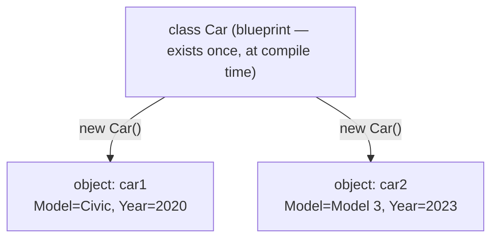

### Constructors

> **New term — Constructor.** A constructor is a special method that runs automatically when `new` creates an object. Its job is to put the object into a valid starting state — assign initial values to its fields. A constructor has the same name as the class and no return type.

If you write no constructor at all, C# silently generates a **parameterless default constructor** that does nothing beyond zeroing out fields. The moment you write *any* constructor yourself, that automatic one disappears — you have to write a parameterless one explicitly if you still want one.

```csharp
class Point
{
    public int X;
    public int Y;

    // Parameterized constructor — caller must supply values
    public Point(int x, int y)
    {
        X = x;
        Y = y;
    }
}

var p = new Point(3, 4); // must pass both args now — no parameterless ctor exists anymore
```

**Constructor overloading** lets a class offer several ways to build an object, resolved at compile time by the argument list (same mechanism as method overloading, [[01-CSharp-Basics]] section 7):

```csharp
class Point
{
    public int X, Y;

    public Point() { X = 0; Y = 0; }              // parameterless
    public Point(int x, int y) { X = x; Y = y; }   // parameterized
}
```
A constructor can also call *another* constructor instead of repeating its logic — that's constructor chaining, covered next.

### Constructor Chaining

> **New term — Constructor chaining.** Constructor chaining is a technique where one constructor calls another constructor, either on the same class (`this(...)`) or on the base class (`base(...)`), instead of repeating the same initialization code. The called constructor always runs to completion first, then control returns to finish the calling constructor's own body.

#### 1. Chaining constructors within the same class (`this`)

Use `this(...)` to have one constructor call another constructor on the *same* class.

**Real-world example:** an HR system's `Employee` class should let code create a placeholder record with no details yet, without duplicating the "set these fields" logic in two places:

```csharp
class Employee
{
    public string Name { get; set; }
    public int Age { get; set; }

    public Employee()
        : this("Unknown", 0)   // calls the parameterized constructor below
    {
    }

    public Employee(string name, int age)
    {
        Name = name;
        Age = age;
    }
}
```
```csharp
Employee emp1 = new Employee();
Console.WriteLine(emp1.Name);   // "Unknown"

Employee emp2 = new Employee("John", 25);
Console.WriteLine(emp2.Name);   // "John"
```

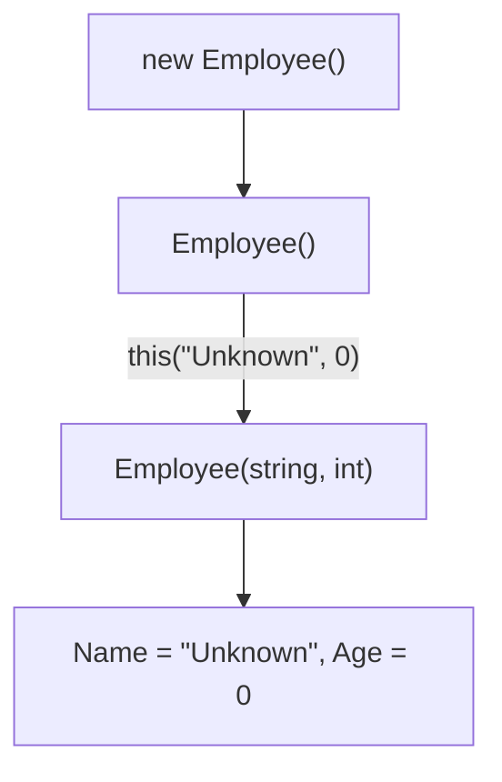
The `this(...)` arrow runs and finishes **before** `Employee()`'s own (empty) body continues — that ordering is the entire point of chaining.

`Employee()` has no initialization logic of its own — it just hands off to `Employee(string, int)` with default values. If a third property were added later, there'd be exactly one constructor body to update, not two.

**Copy constructor — a common `this(...)` pattern.** C# has no built-in copy-constructor language feature like C++ does. A constructor that takes an instance of the same type and copies its fields is just a hand-written convention, and it's often written using `this(...)` to reuse the "real" constructor's logic:

```csharp
class Point
{
    public int X, Y;
    public Point(int x, int y) { X = x; Y = y; }
    public Point(Point other) : this(other.X, other.Y) { }   // "copy constructor" — chains to the one above
}
```
```csharp
var original = new Point(3, 4);
var copy = new Point(original);   // copy.X == 3, copy.Y == 4, but a DIFFERENT object
copy.X = 99;
// original.X is still 3 — copy has its own storage
```

#### 2. Chaining to a base class constructor (`base`)

Use `base(...)` to have a derived class's constructor call a constructor on its *parent* class.

**Real-world example:** the same HR system needs an `Employee` that's specifically a `Person` — the person-level details (like `Name`) should be initialized by `Person`'s own constructor, not duplicated inside `Employee`:

```csharp
class Person
{
    public string Name { get; }

    public Person(string name)
    {
        Name = name;
    }
}

class Employee : Person
{
    public int EmployeeId { get; }

    public Employee(string name, int employeeId)
        : base(name)    // calls Person's constructor
    {
        EmployeeId = employeeId;
    }
}
```
```csharp
Employee emp = new Employee("Alice", 101);
Console.WriteLine(emp.Name);        // "Alice" — set by Person's constructor
Console.WriteLine(emp.EmployeeId);  // 101     — set by Employee's own constructor
```

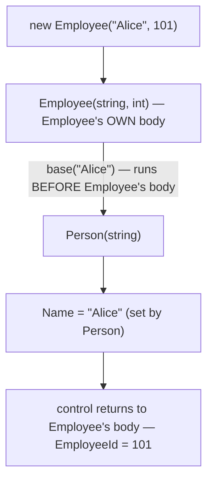
The `base(...)` arrow runs and finishes **before** `Employee`'s own body continues — same ordering rule as the `this(...)` case above.

`Employee` never assigns `Name` itself — it trusts `Person`'s constructor to do that correctly, the same way it trusts `Person` to declare the `Name` property in the first place.

#### Benefits

- Eliminates duplicate initialization code.
- Makes constructors easier to maintain — one place to change, not several.
- Ensures every constructor path produces a consistently-initialized object.
- Improves readability — each constructor's job is visible from its signature alone.

#### Rules

- A constructor can chain to **only one** other constructor — either `this(...)` or `base(...)`, never both.
- The `this(...)`/`base(...)` call must be the first thing in the constructor. It isn't actually a statement inside the `{ }` body — it's part of the constructor's own declaration, written right after the parameter list, before the body even opens. Nothing can run before it, because syntactically there's nowhere to put a statement in front of it.
- You cannot use both `this(...)` and `base(...)` in the same constructor — chaining always means "run exactly one other constructor before mine."

**Quick reference for interviews:**
- **`this(...)`** → calls another constructor on the **same class**.
- **`base(...)`** → calls a constructor in the **parent class**.
- Write **neither**, and C# implicitly inserts a call to the parent's **parameterless** constructor for you — section 11 covers this implicit case in full, including what happens when the parent has no parameterless constructor to fall back on.

#### Going deeper: chaining more than two levels

The examples above each chain exactly two constructors. Chaining can go deeper — each constructor forwarding to the next one in a line, before any of their own bodies run.

**Real-world example:** an e-commerce `Order` needs a customer ID at minimum, but callers should also be able to skip the timestamp (it defaults to "now") or skip everything and get a blank draft order:

```csharp
class Order
{
    public int CustomerId;
    public DateTime PlacedOn;
    public string Status;

    public Order() : this(0) { }                                       // level 1 — chains to level 2
    public Order(int customerId) : this(customerId, DateTime.Now) { }   // level 2 — chains to level 3
    public Order(int customerId, DateTime placedOn)                     // level 3 — the ONLY body that does real work
    {
        CustomerId = customerId;
        PlacedOn = placedOn;
        Status = "Pending";
    }
}

var o = new Order();   // triggers all three constructors in a chain
```

The key rule from above just applies twice in a row here: when constructor A chains to constructor B, **B's entire body finishes running before A's own body starts.** With three levels chained in a line, the innermost constructor's body is always the first one to actually execute:

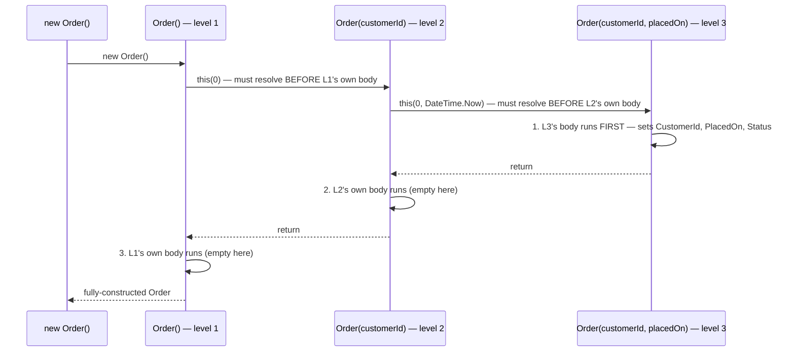

Only `Order(int, DateTime)` contains actual initialization logic. `Order()` and `Order(int)` exist purely to fill in defaults and hand off — that's the whole payoff of chaining: one real implementation, several convenient entry points into it.

### Static constructor

> **New term — Static constructor.** A static constructor initializes a **type itself**, not an instance of it. It runs **at most once per type**, automatically, right before the type is used for the first time — either before the first instance is created, or before any static member is accessed. You never call it yourself, and it can't take parameters or an access modifier.

**Real-world example:** a web application's `Configuration` type loads its connection string from a file once, the first time anything in the app touches configuration — not once per request, and not once per object:

```csharp
class Configuration
{
    public static readonly string ConnectionString;

    static Configuration()   // static constructor — no access modifier, no parameters
    {
        Console.WriteLine("Loading config...");
        ConnectionString = LoadFromFile();
        // runs exactly once, no matter how many Configuration objects get created
    }

    static string LoadFromFile() => "Server=...;";
}
```
The exact trigger moment is "before first use," decided by the CLR (Common Language Runtime — the .NET virtual machine that executes compiled code, see [[01-CSharp-Basics]] section 1), not by you. It's guaranteed to run only once even under multithreading — the CLR takes a lock around it.

### Private constructor

> **New term — Private constructor.** Marking a constructor `private` prevents any code *outside the class* from calling `new` on it. Only the class's own static members can call it. This is the classic building block of the **Singleton** design pattern — a class deliberately restricted to exactly one instance for its entire application lifetime (full eager-vs-lazy/thread-safety treatment lands in [[09-Design-Patterns]]).

**Real-world example:** an application-wide logging service — every part of the app should write to the *same* log file/target, so `AppLogger` is deliberately locked down to one shared instance:

```csharp
class AppLogger
{
    private static readonly AppLogger instance = new AppLogger();

    private AppLogger() { }   // nobody outside this class can `new AppLogger()`

    public static AppLogger Instance => instance;

    public void Log(string message) => Console.WriteLine(message);
}

// AppLogger x = new AppLogger();  // compile error — constructor is private
AppLogger.Instance.Log("Hello");   // the only way in
```

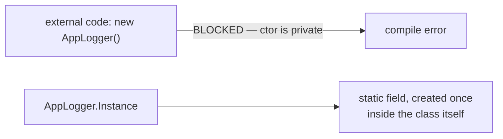

---

## 2. Object References vs Object State

This builds directly on [[01-CSharp-Basics]] section 3 (value vs reference types) and applies it specifically to objects.

> **New term — Identity vs state.** An object has two separate things worth naming: its **identity** (which specific object is this — its location in memory) and its **state** (the current values sitting in its fields). A variable of a class type stores identity — a reference/address. The fields at that address hold the state.

**Real-world example:** a mobile banking app has one `Account` object representing your checking account. If the home screen and the transfer screen both hold a reference to that same object, a deposit made on one screen is instantly visible on the other — they're not looking at two separate copies of your balance:

```csharp
class Account { public decimal Balance; }

Account a = new Account { Balance = 100 };
Account b = a;              // b now holds the SAME reference as a — same identity

b.Balance = 50;
Console.WriteLine(a.Balance); // 50 — a and b are aliases for one object's state
```

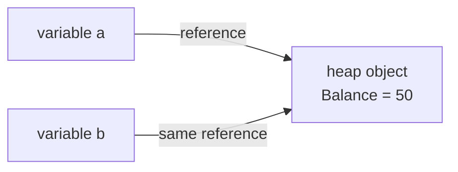
`a` and `b` are two separate variables, but they hold the same address. Mutating state through either one is visible through the other, because there's only ever *one* object here — this is called **aliasing**.

Compare that to two objects with equal-looking, but independent, state:

```csharp
Account c = new Account { Balance = 50 };  // a SEPARATE object, same Balance value

Console.WriteLine(a == c);         // false — reference comparison: different objects
Console.WriteLine(a.Balance == c.Balance); // true — same VALUE, different identity
```

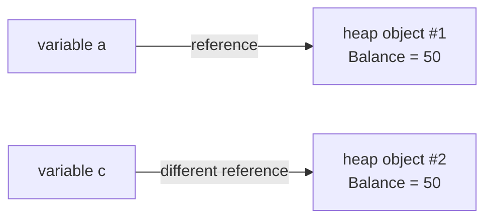
`a` and `c` look identical from the outside — same balance — but they're two entirely separate objects living at two separate addresses. Mutating one never affects the other. Section 19 (Equality) covers exactly how `==` decides which of these two pictures you're looking at.

**Why this matters in practice:** passing an object into a method passes a *copy of the reference*, not a copy of the object (see [[01-CSharp-Basics]] section 3's table). The method can mutate the object's state through that reference — visible to the caller — but reassigning the parameter itself doesn't reach the caller's variable:

```csharp
void Reset(Account acc) { acc.Balance = 0; }        // mutates shared state — VISIBLE to caller
void Replace(Account acc) { acc = new Account(); }  // rebinds the LOCAL copy of the reference — invisible to caller

Reset(a);   // a.Balance is now 0
Replace(a); // a still points to the SAME object as before — untouched
```

`Reset` and `Replace` each receive their own `acc` parameter, and both start out pointing at the exact same object `a` does. What each method *does* with that reference is where they diverge:

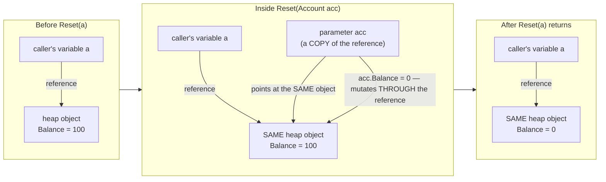
`acc` is a *different variable* from `a`, but both hold the same address. `acc.Balance = 0` doesn't touch `acc` itself — it reaches through the reference into the one shared object, so `a` sees the change too the moment `Reset` returns.

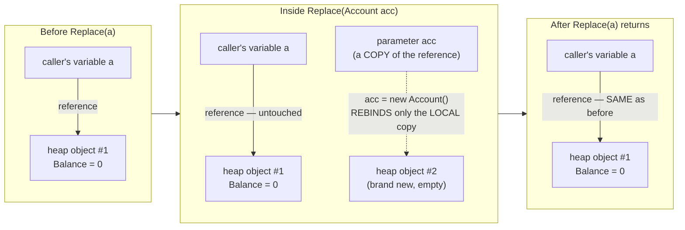
`acc = new Account()` doesn't reach into the object at all — it just points the *local variable* `acc` at a brand-new object instead. `acc` was only ever a copy of `a`'s reference, so rebinding `acc` has no way to change what `a` itself points to. Once `Replace` returns, `acc` (and the new object it pointed to) is gone; `a` never moved.

The rule underneath both diagrams: **method parameters of a reference type are passed by value** — the *value* being copied is the reference itself, not the object it points to (this is the exact same "copy semantics" mechanism as [[01-CSharp-Basics]] section 3, just applied to a reference instead of an `int`). Mutating *through* a copied reference is visible to everyone holding that reference. Reassigning the copy itself is not.

---

## 3. Shallow Copy vs Deep Copy

> **New term — Shallow copy.** A shallow copy creates a new object and copies each field into it. Value-type fields get copied directly, so the copy has independent value-type data. **Reference-type fields are copied as references** — the copy and the original end up pointing at the *same* nested object.

> **New term — Deep copy.** A deep copy goes further: for every reference-type field, it recursively creates a *new* copy of that nested object too, instead of copying the pointer. The result is a copy with fully independent state, all the way down.

**Real-world example:** a checkout flow "duplicates" a saved shipping address onto a new order so the customer can tweak it (e.g. a different apartment number) without silently changing their saved address book entry. The classes and both copy strategies are shown together below, so it's clear exactly what state each example starts from:

```csharp
class Address { public string City = "NYC"; }
class Person
{
    public string Name;      // value-ish here (string is technically a reference type,
                              // but IMMUTABLE — see 01-CSharp-Basics section 6 — so sharing it is harmless)
    public Address Home;     // reference type field — this is where shallow vs deep diverges

    public Person DeepClone() => new Person
    {
        Name = Name,
        Home = new Address { City = Home.City }   // a NEW Address, not the same one — used by the deep-copy example below
    };
}

// --- Shallow copy ---
Person original = new Person { Name = "Alice", Home = new Address() };

Person shallow = (Person)original.MemberwiseClone(); // shallow copy
shallow.Name = "Bob";           // fine — Name is independent now
shallow.Home.City = "Boston";   // ⚠️ mutates the SAME Address original.Home points to!

Console.WriteLine(original.Name);      // "Alice" — untouched
Console.WriteLine(original.Home.City); // "Boston" — changed! shared reference

// --- Deep copy — a fresh Person, independent of "original" above ---
Person source = new Person { Name = "Alice", Home = new Address() };

Person deep = source.DeepClone();
deep.Home.City = "Chicago";

Console.WriteLine(source.Home.City); // "NYC" — untouched, fully independent
```

`MemberwiseClone()` — inherited from `System.Object`, `protected` so it's typically wrapped in a public `Clone()` method — is the built-in way to do a shallow copy. It allocates a new object and blits every field across. `shallow` and `original` end up as two separate `Person` objects, but `Home` is a reference-type field, so both objects' `Home` fields still point at the *same* `Address` object. Mutating `shallow.Home.City` is visible through `original.Home.City` too — that's the shallow-copy trap.

`DeepClone()` fixes this by constructing a brand-new `Address` for the copy, instead of copying the pointer to the existing one. `source` and `deep` end up fully independent all the way down — mutating `deep.Home.City` has no effect on `source.Home.City` at all.

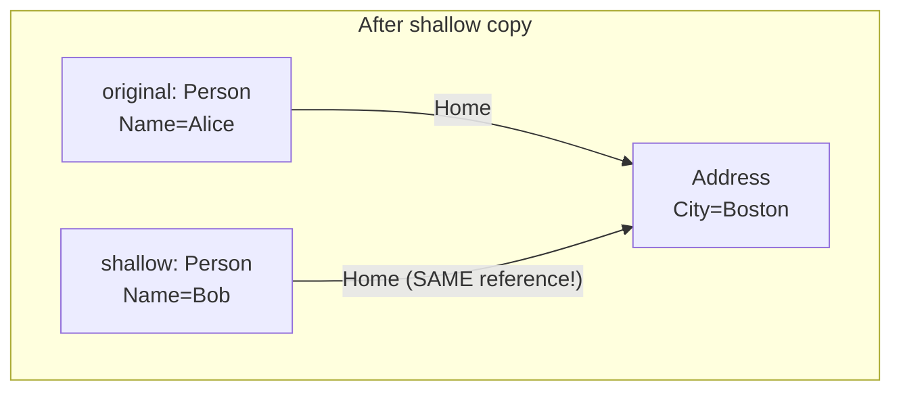
Both `Person` objects have their own `Name`, but they share one `Address` object — this diagram is the shallow-copy trap made visible.

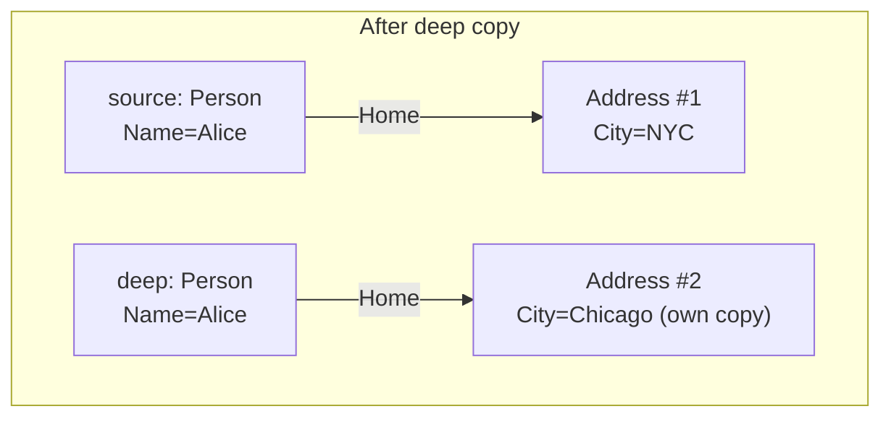
`source` and `deep` don't share a single `Address` node at all — each points at its own, exactly the fix the shallow-copy diagram above was missing.

| | Shallow copy | Deep copy |
|---|---|---|
| Value-type fields | Copied independently | Copied independently |
| Reference-type fields | Same reference shared with original | New, independent object recursively cloned |
| Built-in helper | `MemberwiseClone()` (via `ICloneable.Clone()`, conventionally) | No built-in — write it by hand, field by field |
| Risk | Mutating a nested object through the copy leaks back to the original | None — but more code, and more allocation cost |

**Interview trap:** `ICloneable.Clone()` returns `object` and its documentation deliberately doesn't specify whether an implementation must do a shallow or deep copy — that ambiguity is why many style guides recommend avoiding `ICloneable` entirely and writing an explicit, clearly-named method (`DeepClone()`, `ShallowCopy()`) instead.

---

## 4. Encapsulation and Properties

> **New term — Encapsulation.** Bundle state (fields) with the behavior that operates on it, and hide the internal state behind a controlled interface (properties/methods), so the object is always in a valid state. This is also called **information hiding**. [[01-CSharp-Basics]] section 8 introduced access modifiers as the mechanism; this section covers **properties**, C#'s idiomatic way to expose that controlled interface.

### Why properties exist

**Real-world example:** a bank's ATM software must never let a withdrawal push a balance negative. A public field can't enforce that; a property can.

A public field lets any caller set it to *anything*, with no validation:

```csharp
class BankAccount { public decimal Balance; }
account.Balance = -500; // legal, and almost certainly a bug
```
A property looks like a field from the caller's side, but is actually backed by methods (`get`/`set`) that can run logic:

```csharp
class BankAccount
{
    private decimal balance;

    public decimal Balance
    {
        get { return balance; }
        set
        {
            if (value < 0) throw new ArgumentException("Balance can't be negative");
            balance = value;
        }
    }
}
```
`value` is a compiler-provided implicit parameter name inside every `set` accessor — it holds whatever the caller assigned. Callers still write `account.Balance = 100;`, exactly like a field, but every write now runs through validation.

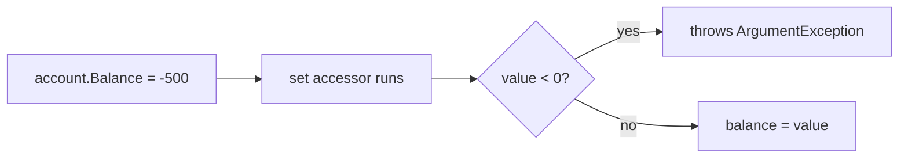

### Auto-implemented properties

When a property needs no custom logic — just "store this, return this" — writing the private backing field by hand is boilerplate. **Auto-properties** let the compiler generate that hidden field for you:

```csharp
public class Person
{
    public string Name { get; set; }        // compiler generates a hidden backing field
    public int Age { get; private set; }     // readable by anyone, settable only inside this class
}
```
`{ get; private set; }` is a very common pattern: expose a value publicly for reading, but restrict *writing* it to the class's own code (typically its constructor or internal methods).

### Init-only properties (C# 9+)

```csharp
public class Person
{
    public string Name { get; init; }   // settable during object-initializer/construction, then locked
}

var p = new Person { Name = "Alice" }; // OK — this happens during construction
// p.Name = "Bob";                      // compile error — init-only, construction has finished
```
`init` behaves like `set`, but only during the object's construction — inside an object initializer (section 5) or the constructor itself. After that, the property becomes read-only. It's the modern way to build **immutable** objects (recall "immutable" from [[01-CSharp-Basics]] section 6: data that can't change after creation) while still supporting the convenient `new Person { ... }` initializer syntax.

### Computed (expression-bodied) properties

A property doesn't have to store anything at all — it can compute its value on every read:

```csharp
public class Rectangle
{
    public double Width { get; set; }
    public double Height { get; set; }

    public double Area => Width * Height;   // computed every time it's read, no backing field
}
```
`=> expression` is an **expression-bodied member** — shorthand for `get { return Width * Height; }`. There's no storage for `Area` at all; it's recalculated from `Width`/`Height` on every access.

### Accessor visibility

`get` and `set` can each carry their own access modifier, as long as it's *more restrictive* than the property's own:

```csharp
public class Order
{
    public decimal Total { get; private set; }  // public read, private write
    protected internal string Status { get; set; }
}
```

| Property declaration | Read from outside | Write from outside |
|---|---|---|
| `public int X { get; set; }` | ✅ | ✅ |
| `public int X { get; private set; }` | ✅ | ❌ (only inside the class) |
| `public int X { get; init; }` | ✅ | ❌ after construction |
| `private int X { get; set; }` | ❌ | ❌ |

**Interview trap:** a property is *syntax sugar* — at the IL (Intermediate Language) level, `public int X { get; set; }` compiles down to a private backing field plus two ordinary methods, `get_X()` and `set_X()`. This is why properties, unlike fields, can be declared on interfaces (an interface can require a `get_X`/`set_X` method pair to exist, but can't require a raw field to exist) — see section 16.

---

## 5. Object Initializer Syntax

> **New term — Object initializer.** `new Type { Prop1 = val1, Prop2 = val2 }` is syntax that sets properties/fields right after construction, without needing a matching constructor overload for every combination of values.

**Real-world example:** an HR onboarding form collects an `Employee`'s ID, name, and department all at once — object initializer syntax lets the form's "submit" code build the object in one expression instead of one constructor overload per combination of fields:

```csharp
class Employee
{
    public int Id { get; set; }
    public string Name { get; set; }
    public string Department { get; set; }
}

var emp = new Employee { Id = 1, Name = "Alex", Department = "Engineering" };
```
This desugars to roughly:
```csharp
Employee __temp = new Employee();  // 1. parameterless constructor runs FIRST
__temp.Id = 1;                     // 2. then each property is set, in the order written
__temp.Name = "Alex";
__temp.Department = "Engineering";
Employee emp = __temp;
```


**Harder case — nested object initializers.** Once a property is itself a reference type, its object initializer can nest right inside the outer one:

```csharp
class Address
{
    public string City { get; set; }
    public string Zip { get; set; }
}
class Employee
{
    public int Id { get; set; }
    public string Name { get; set; }
    public Address HomeAddress { get; set; }   // reference-type property
}

var emp = new Employee
{
    Id = 2,
    Name = "Priya",
    HomeAddress = new Address { City = "Austin", Zip = "78701" }   // nested initializer
};
```
Nested initializers evaluate **inside-out**: the inner `Address` object is fully constructed and initialized *before* it's ever assigned to `HomeAddress`, exactly the way any other expression on the right-hand side of `=` would be evaluated first.

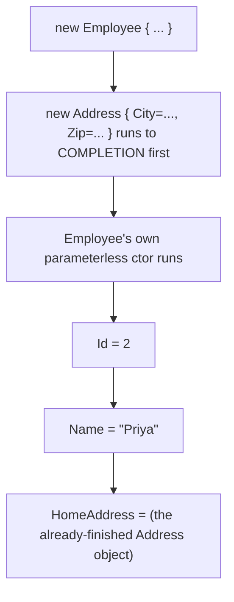

**Object initializer vs constructor** — when to reach for each:

| | Object initializer | Constructor |
|---|---|---|
| Requires a parameterless (or accessible) constructor to exist | Yes | No |
| Enforces which properties *must* be set | No — every property is optional, easy to forget one | Yes — required values go in the parameter list |
| Good for | Optional/many settable properties, test data, config objects | Required invariants, validation on construction, immutability |
| Works with `init`-only properties | Yes | Yes |
| Works with `private set` properties | No — can't assign from outside the class | Yes — the constructor is inside the class |

**Interview trap:** object initializers run *after* the constructor completes, not instead of it. If a class has validation logic in its constructor but not in its property setters, an object initializer can produce an object the constructor's own validation would have rejected.

**Real-world example:** a scheduling app's `Appointment` class validates that a meeting's end time is after its start time — but only inside the constructor:

```csharp
class Appointment
{
    public DateTime Start { get; set; }
    public DateTime End { get; set; }

    public Appointment(DateTime start, DateTime end)
    {
        if (end <= start)
            throw new ArgumentException("End must be after Start");
        Start = start;
        End = end;
    }
}
```
```csharp
var ok = new Appointment(DateTime.Today.AddHours(9), DateTime.Today.AddHours(10));   // fine
var bad = new Appointment(DateTime.Today.AddHours(10), DateTime.Today.AddHours(9));  // throws — correctly rejected
```
This is safe **as long as the constructor is the only way to build an `Appointment`.** The bug appears later, when the class gets refactored to also support object-initializer syntax — for example, so a UI form-binding library or a test-data builder can construct one property-by-property:

```csharp
class Appointment
{
    public DateTime Start { get; set; }
    public DateTime End { get; set; }

    public Appointment() { }   // added later, purely to enable object-initializer syntax

    public Appointment(DateTime start, DateTime end)
    {
        if (end <= start)
            throw new ArgumentException("End must be after Start");
        Start = start;
        End = end;
    }
}

var stillBad = new Appointment
{
    Start = DateTime.Today.AddHours(10),
    End = DateTime.Today.AddHours(9)   // End before Start — the OTHER constructor would have thrown for this!
};
// no exception at all — Start and End are plain auto-properties, and neither setter checks anything
```
Nobody touched the validation logic. Adding the parameterless constructor was enough, on its own, to reopen a hole the parameterized constructor's `if (end <= start) throw` used to close for every caller.

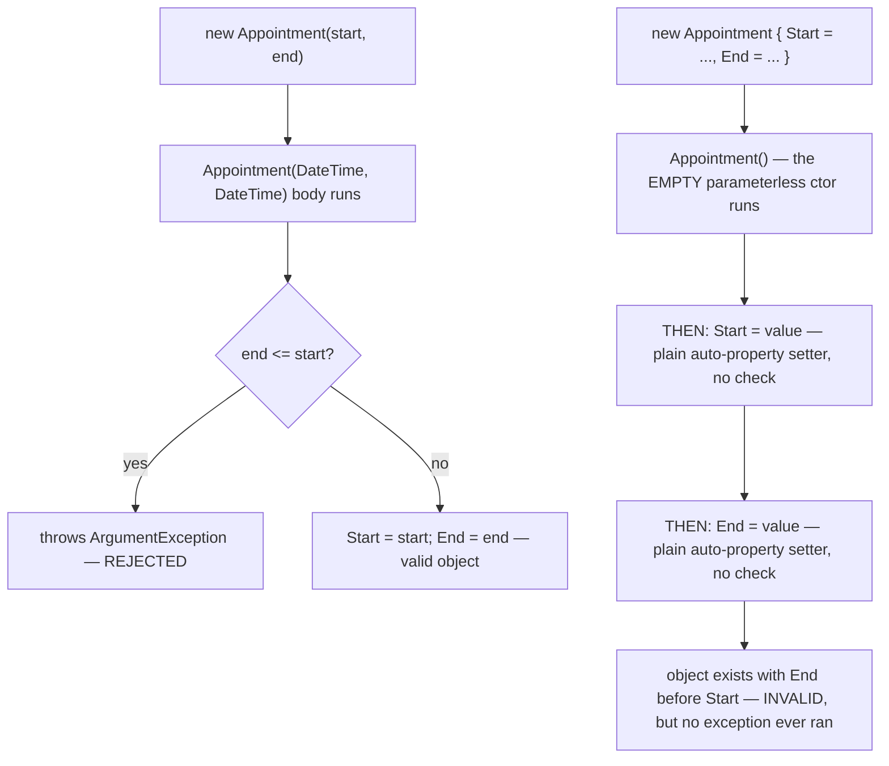
Both paths construct the exact same class, but only one of them ever runs the validation, because the validation lives in a constructor *body* the object-initializer path skips straight past. The real fix is to move the check into `End`'s own setter, so it applies no matter which constructor was used to get there:

```csharp
public DateTime Start { get; set; }
private DateTime end;
public DateTime End
{
    get => end;
    set
    {
        if (value <= Start) throw new ArgumentException("End must be after Start");
        end = value;
    }
}
```
This has its own subtlety worth flagging: an object initializer sets properties in the order they're written, so `Start` must appear before `End` in `new Appointment { ... }` for this setter to see the correct `Start` value at the moment it validates.

---

## 6. `static` Members vs Instance Members

> **New term — static.** `static` attaches a member to the **type itself**, not to any individual object. There is exactly one copy of a static field for the whole application, shared by every object of that class — as opposed to instance members, where each object gets its own separate copy.

**Real-world example:** think of a customer support system like Zendesk. Every new support ticket gets a unique, ever-increasing ticket number — `#1`, `#2`, `#3`, however many agents or customers are creating tickets at once. That single running counter has to be shared **across every ticket**, which is exactly what a `static` field gives you:

```csharp
class SupportTicket
{
    public static int TotalCreated = 0;   // ONE copy, shared by every SupportTicket object
    public int TicketNumber;               // one copy PER OBJECT

    public SupportTicket()
    {
        TotalCreated++;                    // shared counter increments for every ticket ever opened
        TicketNumber = TotalCreated;
    }
}

var t1 = new SupportTicket();
var t2 = new SupportTicket();
var t3 = new SupportTicket();

Console.WriteLine(SupportTicket.TotalCreated); // 3 — accessed via the TYPE, not a ticket instance
Console.WriteLine(t1.TicketNumber); // 1
Console.WriteLine(t3.TicketNumber); // 3
```

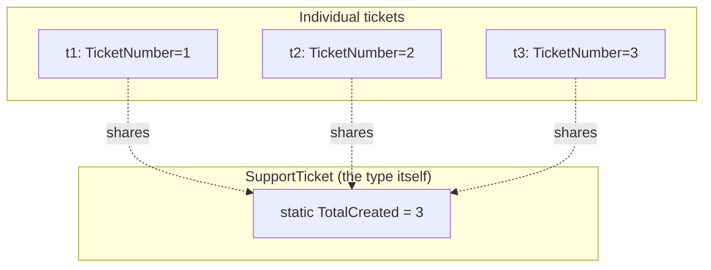
If `TotalCreated` were an instance field instead, every ticket would start its own count at zero, and two tickets could both claim to be "#1" — the whole point of `static` here is that there's exactly one counter, not one per ticket.

**Harder case — a shared static collection, not just a counter.** A single `int` counter is the simplest possible static field. A more realistic use is a static field holding an entire *collection*, acting as a shared registry every instance publishes itself into:

```csharp
class Product
{
    private static readonly Dictionary<string, Product> catalog = new();  // ONE dictionary, shared by every Product

    public string Sku { get; }
    public string Name { get; }

    public Product(string sku, string name)
    {
        Sku = sku;
        Name = name;
        catalog[sku] = this;          // every new Product registers ITSELF into the shared registry
    }

    public static Product Find(string sku) =>
        catalog.TryGetValue(sku, out var p) ? p : null;
}

new Product("SKU-1", "Keyboard");
new Product("SKU-2", "Mouse");

Product found = Product.Find("SKU-2");
Console.WriteLine(found.Name);   // "Mouse" — looked up through the TYPE, without ever holding a direct reference
```

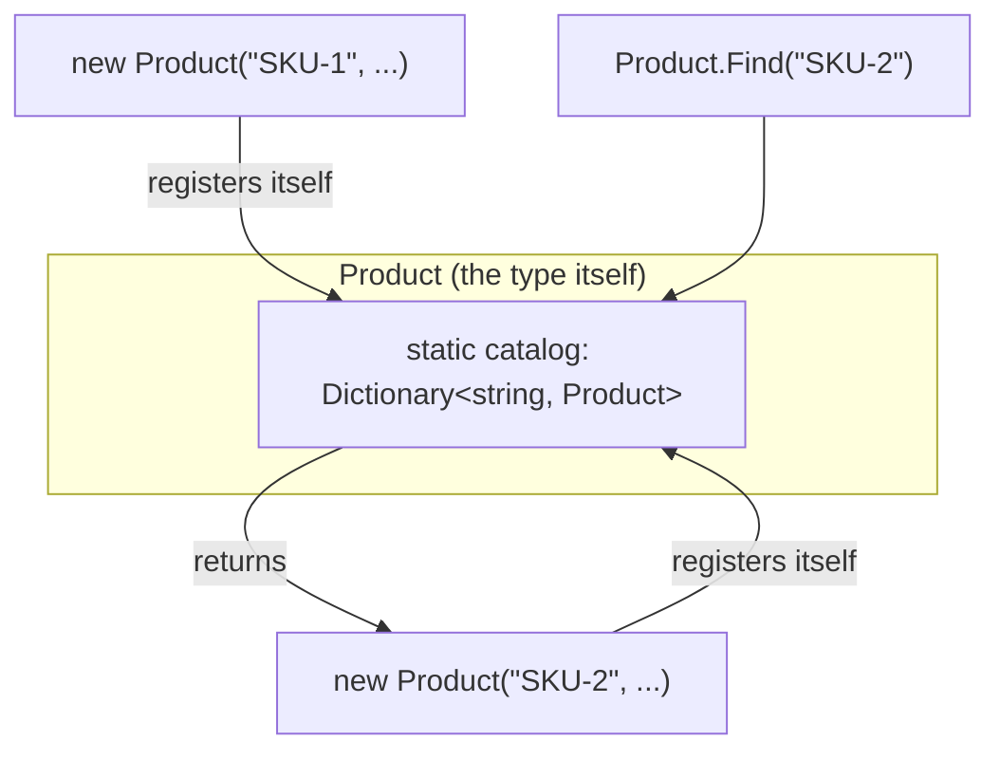
This is a step up from a plain counter because `catalog` is a single **mutable, shared object** — the exact aliasing situation from section 2, just held by the type instead of by a variable. Any code anywhere in the app that reaches `Product.Find(...)` sees every product ever constructed, which is powerful, but also means uncontrolled writes to a static collection from multiple places (or multiple threads) can corrupt shared state in ways an instance field never could — a preview of why static mutable state needs careful synchronization in multithreaded code.

| | Instance member | Static member |
|---|---|---|
| Storage | One copy per object, on the heap alongside the object | One copy total, lives for the app's lifetime |
| Accessed via | `objectVariable.Member` | `TypeName.Member` |
| Can use `this`? | Yes | No — there's no specific object to refer to |
| Typical use | Data/behavior that varies per object | Shared counters, utility methods (`Math.Sqrt`), caches, constants |

**When the static constructor fires**, concretely: the very first time *any* static member of the type is touched, or the first time the type is instantiated — whichever comes first. It never fires if the type is never used at all.

```csharp
class Demo
{
    public static int Value;
    static Demo() { Console.WriteLine("Static ctor ran"); Value = 42; }
}

// Nothing printed yet — Demo hasn't been touched
Console.WriteLine(Demo.Value); // NOW "Static ctor ran" prints, then 42
```

---

## 7. `static class`

> **New term — `static class`.** Adding `static` to a `class` declaration makes the *entire class* static: every member inside it must also be `static`, the class can never be instantiated with `new`, and it can never be inherited from. The compiler enforces this by making the generated type both `sealed` (section 17) and `abstract` under the hood — a combination that's otherwise impossible to write by hand, and exists purely to mean "this can never be instantiated or subclassed."

**Real-world example:** the BCL's own `Math` and `Console` types are exactly this shape — nobody ever needs a *specific instance* of "math," just its functions, callable from anywhere:

```csharp
public static class MathUtils
{
    public static double SquareArea(double side) => side * side;
    // public double InstanceMethod() { }  // compile error — instance members aren't allowed
}

double area = MathUtils.SquareArea(5); // called via the type name, never an instance
// var m = new MathUtils();            // compile error — cannot instantiate
```

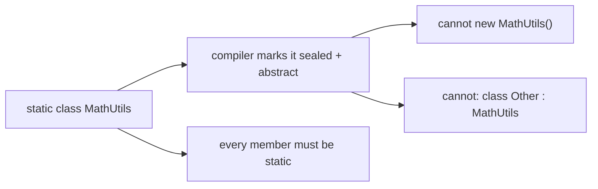

Common real-world uses: `Math`, `Console`, and extension method containers (covered in [[03-CSharp-Intermediate]]) are all `static class`. The rule of thumb: reach for `static class` when a type is purely a bag of stateless utility functions with no need for multiple independent instances — reach for the private-constructor Singleton pattern (section 1) instead when you need actual object identity (e.g. something implementing an interface, or holding mutable per-instance state, just restricted to one instance).

---

## 8. Inheritance vs Composition

> **New term — Inheritance ("is-a").** Inheritance lets one class (the **derived**/**subclass**) reuse and extend another class's (the **base**/**superclass**) members. A derived class automatically gets everything the base class exposes, and can add or override behavior on top.

> **New term — Composition ("has-a").** Composition builds a class by holding references to *other* objects as fields, and delegating work to them, instead of inheriting their code.

**Real-world example:** a car manufacturer's software models this exact distinction — a `Car` genuinely *is a* `Vehicle` (it shares the general vehicle contract), but a `Car` *has an* `Engine` (it's built from one, not descended from one):

```csharp
// Inheritance — Car "is-a" Vehicle
class Vehicle { public void Start() => Console.WriteLine("Starting..."); }
class Car : Vehicle { }
new Car().Start(); // inherited directly, no code written in Car

// Composition — Car "has-a" Engine
class Engine { public void Start() => Console.WriteLine("Engine starting..."); }
class Car
{
    private readonly Engine engine = new Engine();   // Car HOLDS an Engine
    public void Start() => engine.Start();            // Car DELEGATES to it
}
```

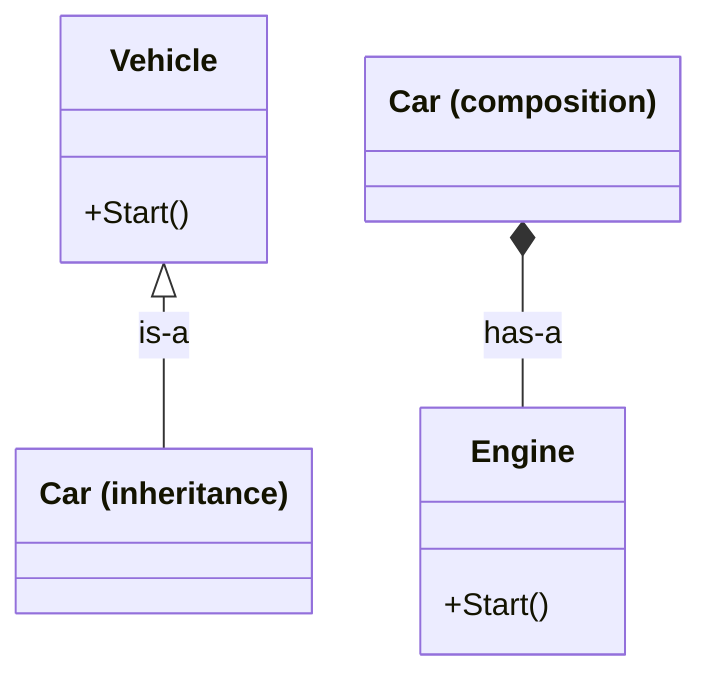

**"Favor composition over inheritance"** is a widely-cited design principle. The reasoning:

- **Inheritance is a tight coupling.** A subclass depends on its base class's *implementation details*, not just its public contract. A seemingly-safe change to the base class (adding a call to a method the subclass also overrides) can silently break every subclass — this is called the **fragile base class problem**.
- **Inheritance is single-rooted in C#** — a class can only extend *one* base class (section 9). Composition has no such limit: a class can hold as many collaborator objects as it needs.
- **Composition can be swapped at runtime.** `car.engine` could be reassigned to a different `Engine` implementation; you can never swap what a class inherits from after it's compiled.
- Inheritance is still the right tool when there's a genuine, stable "is-a" relationship and you want **polymorphism** (section 14) — treating many derived types uniformly through a shared base type. Composition wins for "reuse this behavior" without wanting that substitutability.

### The fragile base class problem, concretely

**Real-world example:** a reporting library ships a `ReportGenerator` base class. A consumer of the library writes `PdfReportGenerator`, overriding one method to customize how PDFs render their header:

```csharp
// Version 1 of the library
class ReportGenerator
{
    public virtual string FormatHeader() => "REPORT";
    public string GenerateSummary() => $"{FormatHeader()}\n---\nSummary here";
}
class PdfReportGenerator : ReportGenerator
{
    public override string FormatHeader() => "REPORT (PDF)";   // written to affect GenerateSummary() ONLY
}
```
Later, the library author adds a seemingly unrelated feature — a footer — and reuses the same `FormatHeader()` call to save writing a second method:

```csharp
// Version 2 of the library — a small, "safe-looking" addition
class ReportGenerator
{
    public virtual string FormatHeader() => "REPORT";
    public string GenerateSummary() => $"{FormatHeader()}\n---\nSummary here";
    public string GenerateFooter() => $"{FormatHeader()}\n---\nEnd of report";   // NEW — also calls FormatHeader()
}
```
`PdfReportGenerator`'s source code hasn't changed at all, but its behavior has: `new PdfReportGenerator().GenerateFooter()` now silently prints `"REPORT (PDF)"` in the footer too, a context its author never wrote or tested for. Nobody touched `PdfReportGenerator`, and nothing about `ReportGenerator`'s public contract looked dangerous to extend — that's exactly what makes this class of bug hard to catch in review.

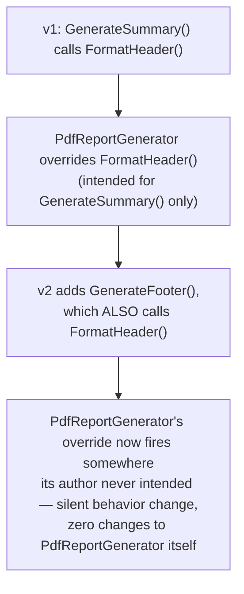
Composition sidesteps this entirely: if `ReportGenerator` *held* a `HeaderFormatter` object instead of exposing an overridable method, adding `GenerateFooter()` could only affect behavior the caller explicitly wired up, never behavior implicitly inherited through an override.

```csharp
interface IHeaderFormatter { string Format(); }
class DefaultHeaderFormatter : IHeaderFormatter { public string Format() => "REPORT"; }
class PdfHeaderFormatter : IHeaderFormatter { public string Format() => "REPORT (PDF)"; }

// v1 — ReportGenerator HOLDS a formatter, instead of exposing a method to override
class ReportGenerator
{
    private readonly IHeaderFormatter headerFormatter;
    public ReportGenerator(IHeaderFormatter headerFormatter) => this.headerFormatter = headerFormatter;

    public string GenerateSummary() => $"{headerFormatter.Format()}\n---\nSummary here";
}

var pdfReport = new ReportGenerator(new PdfHeaderFormatter());
pdfReport.GenerateSummary();   // "REPORT (PDF)\n---\nSummary here"
```
Now replay the exact same "library author adds a footer" change from the inheritance example — but this time against the composition version:

```csharp
// v2 — the "seemingly unrelated feature" gets added again
class ReportGenerator
{
    private readonly IHeaderFormatter headerFormatter;
    public ReportGenerator(IHeaderFormatter headerFormatter) => this.headerFormatter = headerFormatter;

    public string GenerateSummary() => $"{headerFormatter.Format()}\n---\nSummary here";
    public string GenerateFooter() => "End of report";   // NEW — does NOT touch headerFormatter at all
}

pdfReport.GenerateFooter();   // "End of report" — PdfHeaderFormatter never ran, nothing leaked in
```
`GenerateFooter()` simply doesn't reference `headerFormatter`. Nothing about `PdfHeaderFormatter` fires here, because nothing in `ReportGenerator`'s own new code told it to. If the library author *did* want the footer to reuse the same header style, that's a visible, deliberate line — `headerFormatter.Format()` — written inside `GenerateFooter()` itself, reviewable in the very same diff that introduced it:

```csharp
public string GenerateFooter() => $"{headerFormatter.Format()}\n---\nEnd of report";   // an explicit CHOICE, not an accident
```

```mermaid
flowchart TB
    A["ReportGenerator holds an IHeaderFormatter field"] --> B["GenerateSummary() explicitly calls headerFormatter.Format()"]
    C["v2 adds GenerateFooter()"] --> D{"does GenerateFooter()'s OWN code call headerFormatter.Format()?"}
    D -->|"yes — author wrote that line on purpose"| E["PdfHeaderFormatter.Format() runs —\nvisible in the SAME diff, reviewable"]
    D -->|"no — author didn't write that line"| F["PdfHeaderFormatter never runs here —\nfooter behaves independently, nothing implicit"]
```
Compare that to the inheritance version's diagram above: there, `PdfReportGenerator`'s override fired the moment `ReportGenerator` called `FormatHeader()` from anywhere, with zero say from `PdfReportGenerator`'s own code and zero new lines to review inside it. With composition, `ReportGenerator` can only reach `headerFormatter` through calls it writes itself — there's no mechanism for a base class change to silently reach into a caller-supplied collaborator's behavior the way virtual dispatch reaches into an override.

**Interview trap:** "favor composition over inheritance" doesn't mean "never use inheritance." It means: reach for inheritance only when a true is-a relationship exists and polymorphic substitution is actually needed, not merely to avoid retyping a method.

---

## 9. Types of Inheritance

C# supports several *shapes* of inheritance between classes, plus one it deliberately does **not** support.

**Real-world example:** a pet-store app's `Animal` hierarchy naturally exercises every shape below — a single `Dog` extending `Animal`, a `Mammal` layer between them, and many unrelated animal types (`Dog`, `Cat`, `Bird`) all sharing one `Animal` base:

```mermaid
classDiagram
    class Animal
    class Dog
    Animal <|-- Dog
    note for Dog "Single inheritance:\none base, one derived"
```
```mermaid
classDiagram
    class Animal
    class Mammal
    class Dog
    Animal <|-- Mammal
    Mammal <|-- Dog
    note for Dog "Multilevel inheritance:\na chain, A -> B -> C"
```
```mermaid
classDiagram
    class Animal
    class Dog
    class Cat
    class Bird
    Animal <|-- Dog
    Animal <|-- Cat
    Animal <|-- Bird
    note for Animal "Hierarchical inheritance:\none base, MANY direct derived classes"
```

| Type | Shape | C# support |
|---|---|---|
| Single | One base, one derived | ✅ |
| Multilevel | Chain: A → B → C, each level adds on top of the last | ✅ |
| Hierarchical | One base, multiple independent derived classes | ✅ |
| Multiple (class) | One class inheriting from *two or more* base classes at once | ❌ — **not allowed in C#** |
| Multiple (interface) | One type implementing two or more interfaces at once | ✅ — this is C#'s answer to "multiple inheritance" |

### Why C# has no multiple class inheritance

The classic problem multiple class inheritance runs into is the **diamond problem**: if `D` inherits from both `B` and `C`, and both `B` and `C` inherit from `A`, which version of a member does `D` get if `B` and `C` each override it differently? C# sidesteps the ambiguity entirely by only allowing a class to have **one** direct base class.

```mermaid
classDiagram
    class A
    class B
    class C
    class D
    A <|-- B
    A <|-- C
    B <|-- D
    C <|-- D
    note for D "The diamond problem —\nC# simply disallows this shape for classes"
```

**Multiple inheritance via interfaces** is how C# gets the "combine behavior from several sources" benefit without the diamond ambiguity — because (outside of C# 8's default interface methods) interfaces only declare a *contract*, not implementation, so there's nothing to conflict:

```csharp
interface IFlyable { void Fly(); }
interface ISwimmable { void Swim(); }

class Duck : IFlyable, ISwimmable   // implements BOTH — legal
{
    public void Fly() => Console.WriteLine("Flying");
    public void Swim() => Console.WriteLine("Swimming");
}
```
Every derived-class member access still resolves unambiguously, because `Duck` itself supplies the one and only implementation for each method — there's no competing implementation being inherited from two different sources. Section 16 covers what happens when two interfaces declare a method with the *same signature* (explicit interface implementation resolves that specific collision).

---

## 10. Access Modifiers Across Inheritance Boundaries

[[01-CSharp-Basics]] section 8 introduced the five access modifiers and their general visibility matrix. This section applies that specifically to what a derived class can see and do with its base class's members.

> **New term — Access modifier (recap).** `public`, `private`, `protected`, `internal`, `protected internal`, `private protected` control which code is allowed to reference a given member. Inheritance is where the difference between them stops being academic — it directly decides what a subclass can override, call, or even see.

| Modifier | Visible to derived class in the **same** assembly | Visible to derived class in a **different** assembly |
|---|---|---|
| `public` | ✅ | ✅ |
| `protected` | ✅ | ✅ |
| `internal` | ✅ (it's in the same assembly) | ❌ |
| `protected internal` | ✅ | ✅ (protected condition alone satisfies it) |
| `private protected` | ✅ | ❌ (fails the "same assembly" half) |
| `private` | ❌ — not even the declaring class's own subclasses can see it | ❌ |

**Real-world example:** a bank's `BankAccount` base class, and a `SavingsAccount` that extends it, need to draw the line differently for different fields — a PIN nobody outside the class should ever touch, a balance subclasses are trusted to adjust, and an account number the whole app can read:

```csharp
public class BankAccount
{
    private string pin = "1234";        // invisible even to SavingsAccount
    protected decimal balance = 0;      // SavingsAccount can read/write this directly
    public string AccountNumber = "ACC-001";
}

public class SavingsAccount : BankAccount
{
    public void ApplyInterest(decimal rate)
    {
        // Console.WriteLine(pin); // compile error — private, not visible here
        balance += balance * rate;       // OK — protected
        Console.WriteLine(AccountNumber); // OK — public
    }
}
```

```mermaid
flowchart TB
    subgraph Base["class BankAccount"]
        Pv["private pin"]
        Pr["protected balance"]
        Pu["public AccountNumber"]
    end
    subgraph Derived["class SavingsAccount : BankAccount"]
        D1["can see: balance, AccountNumber"]
        D2["CANNOT see: pin"]
    end
```

**Interview trap:** a derived class inherits a `private` base member's *storage and behavior* — if `BankAccount`'s own methods use `pin` (e.g. a `Verify(string attempt)` method), those methods still work correctly when called on a `SavingsAccount` object — but `SavingsAccount`'s *own code* can never reference `pin` by name. Private truly means "only code written inside this exact class," inheritance included.

---

## 11. Constructors in an Inheritance Hierarchy

### Implicit vs explicit base calls

Every constructor in a derived class implicitly calls its base class's **parameterless** constructor first, unless you say otherwise:

```csharp
class Animal
{
    public Animal() { Console.WriteLine("Animal ctor"); }
}
class Dog : Animal
{
    public Dog() { Console.WriteLine("Dog ctor"); }   // implicitly calls Animal() first
}

new Dog();
// Output:
// Animal ctor
// Dog ctor
```
If `Animal` has *no* parameterless constructor — only a parameterized one — `Dog` **must** explicitly chain to it with `base(...)`, or the code won't compile:

```csharp
class Animal
{
    public string Name;
    public Animal(string name) { Name = name; }   // no parameterless ctor exists
}
class Dog : Animal
{
    public Dog(string name) : base(name)   // MUST forward to Animal's constructor explicitly
    {
        Console.WriteLine($"Dog ctor for {name}");
    }
}
```

### Precise execution order

This is a frequently-tested sequence, and the order is fixed and non-negotiable:

```mermaid
sequenceDiagram
    participant Code as new Dog()
    participant Animal
    participant Dog
    Code->>Animal: 1. base field initializers run
    Animal->>Animal: 2. Animal constructor BODY runs (fully finishes)
    Animal-->>Dog: base construction complete
    Dog->>Dog: 3. Dog's OWN field initializers run
    Dog->>Dog: 4. Dog constructor BODY runs
    Dog-->>Code: object fully constructed
```

For a multi-level chain (`GrandBase` → `Base` → `Derived`), the same rule just repeats outward-in at every level: **the entire base class finishes constructing — field initializers, then constructor body — before the derived class's own field initializers even start.** The chain of `base(...)` calls runs all the way up to `object` first, then unwinds back down, each level completing fully before the next one below it begins.

```csharp
class GrandBase { public GrandBase() => Console.WriteLine("GrandBase"); }
class Base : GrandBase { public Base() => Console.WriteLine("Base"); }
class Derived : Base { public Derived() => Console.WriteLine("Derived"); }

new Derived();
// GrandBase
// Base
// Derived
```

### The classic trap: calling a `virtual` method from a base constructor

**Real-world example:** this exact bug shows up in UI (User Interface) frameworks. A base `Widget` class calls a virtual `Render()` method from its own constructor, meaning to draw a default appearance immediately on creation. A derived `Button` class overrides `Render()` to draw itself using its own `Label` field:

```csharp
class Widget
{
    public Widget() { Render(); }              // ⚠️ calls a virtual method from the constructor
    public virtual void Render() => Console.WriteLine("Generic widget");
}
class Button : Widget
{
    private string label = "OK";        // derived field initializer

    public override void Render() => Console.WriteLine($"Button [{label}]");
}

new Button();
// Output: "Button []" — label is EMPTY, not "OK"!
```
Here's why: `virtual`/`override` dispatch (fully explained in section 14) always resolves to the **most-derived override**, based on the object's actual runtime type — even when the call happens from inside a base constructor. `Widget()`'s call to `Render()` dispatches to `Button.Render()`, because the object under construction really is a `Button`. But per the execution order above, `Button`'s own field initializers (`label = "OK"`) haven't run yet — they're step 3, and we're still inside step 2. `label` is still sitting at its default value, `null`, because the runtime hasn't reached the line that sets it. Every `new Button()` in the app renders with a blank label, and the bug is invisible just from reading `Button` in isolation — it only shows up by tracing the full construction order.

```mermaid
flowchart TB
    A["new Button()"] --> B["Widget() ctor body runs"]
    B --> C["calls virtual Render()"]
    C --> D["dispatches to Button.Render()\n(runtime type IS Button)"]
    D --> E["reads Button's label field —\nstill default(null), init hasn't run yet!"]
    E --> F["Button's own field initializers finally run"]
    F --> G["Button() ctor body runs"]
```

**This is exactly why "never call virtual members from a constructor" is standard guidance.** The object is only half-built at that point, and any override can observe that half-built state — a bug that's notoriously hard to spot in code review, because both `Base` and `Derived` look individually correct in isolation.

---

## 12. The `base` Keyword Beyond Constructors

Section 11 covered `base(...)` for constructor chaining. `base` has two more uses.

### `base.Method(...)` — extending rather than replacing

**Real-world example:** a logging library ships a plain `Logger`. An app wants every log line timestamped, without reimplementing how `Logger` actually writes output — `base.Log(...)` lets it reuse that part:

Inside an `override`, calling `base.Method(...)` invokes the parent's original implementation explicitly, letting the override *add to* base behavior instead of fully replacing it:

```csharp
class Logger
{
    public virtual void Log(string msg) => Console.WriteLine($"[LOG] {msg}");
}
class TimestampedLogger : Logger
{
    public override void Log(string msg)
    {
        base.Log($"{DateTime.Now:HH:mm:ss} - {msg}");  // runs the base version too
    }
}
```
Without `base.Log(...)`, the override would have to reimplement the console-writing logic itself. With it, `TimestampedLogger` reuses `Logger`'s implementation and only adds the timestamp prefix on top.

### `base.Member` — disambiguating a member hidden by `new`

Section 13 explains `new`-based method hiding in full. When a derived class hides a base member with `new`, `base.Member` is the only way to reach the original, hidden-away base version from inside the derived class:

```csharp
class Base { public string Name = "Base"; }
class Derived : Base
{
    public new string Name = "Derived";   // hides Base.Name — see section 13

    public void PrintBoth()
    {
        Console.WriteLine(Name);       // "Derived"
        Console.WriteLine(base.Name);  // "Base" — otherwise unreachable from here
    }
}
```

---

## 13. Method Hiding (`new`) vs Overriding (`override`)

This is one of the highest-value interview traps in C#, because the two look almost identical at a glance but resolve **completely differently**.

> **New term — Binding (compile-time vs run-time).** "Binding" means deciding *which actual method body runs* for a given call. **Compile-time (static) binding** decides this once, permanently, when the code is compiled — based on the variable's *declared* type. **Run-time (dynamic) binding** decides it fresh on every call, based on the object's *actual* type at that moment. This distinction is the entire reason `new` and `override` behave differently.

### The minimal version, first

Before the real-world trap below, here's the mechanism in isolation — as small as it gets:

```csharp
class Animal
{
    public void Speak() => Console.WriteLine("Animal sound");   // NOT virtual
}
class Dog : Animal
{
    public new void Speak() => Console.WriteLine("Bark");   // HIDES Animal.Speak — there's nothing to override
}

Dog d = new Dog();
Animal a = d;   // a and d point at the exact same object

d.Speak();   // "Bark"          — d's DECLARED type is Dog
a.Speak();   // "Animal sound"  — a's DECLARED type is Animal — decided at COMPILE time, ignoring the real object
```
Same object, same method name, two different results — purely because of which *variable* the call was written through. That's the whole mechanism. The next example shows how easily this hides inside code that looks completely ordinary.

**Real-world example:** a payroll system has an `Employee` class and a `Manager` subclass. `PrintBadge()` isn't `virtual` — nobody expected it to ever need a different version, so a `Manager` badge accidentally gets **hidden** with `new` instead of properly overridden. `CalculateBonus()` *is* `virtual`, and correctly `override`n:

```csharp
class Employee
{
    public void PrintBadge() => Console.WriteLine("Employee Badge");
    public virtual decimal CalculateBonus() => 500m;
}
class Manager : Employee
{
    public new void PrintBadge() => Console.WriteLine("Manager Badge (VIP access)"); // HIDES, doesn't override
    public override decimal CalculateBonus() => 2000m;                              // truly OVERRIDES
}
```

```csharp
Manager m = new Manager();
Employee e = m;   // SAME person — e.g. m stored in a List<Employee> the payroll batch job iterates over

m.PrintBadge();       // "Manager Badge (VIP access)" — declared type is Manager
e.PrintBadge();       // "Employee Badge"              — declared type is Employee — resolved at COMPILE time!

m.CalculateBonus();   // 2000
e.CalculateBonus();   // 2000 — resolved at RUN time, from the object's ACTUAL type
```
This is a genuinely dangerous bug, not just a syntax quirk: a badge-printing kiosk that loops over `List<Employee>` (the natural way to process a mixed staff list) will silently print the *plain* employee badge for every manager in the list, because it only ever sees them through the `Employee`-typed variable. `CalculateBonus()` doesn't have this problem — `override` guarantees the manager's real bonus logic runs no matter what type the calling code declared the variable as.

```mermaid
flowchart TB
    subgraph Hiding["new (method hiding) — compile-time binding"]
        H1["e.PrintBadge() — e's DECLARED type is Employee"] --> H2["compiler bakes in a call to Employee.PrintBadge()\nforever, regardless of what e actually points to"]
    end
    subgraph Overriding["override — run-time binding (virtual dispatch)"]
        O1["e.CalculateBonus()"] --> O2["compiler emits: 'look up the object's ACTUAL type at runtime'"]
        O2 --> O3["object is really a Manager → calls Manager.CalculateBonus()"]
    end
```

Same underlying object (`m` and `e` point at the exact same instance), same method name, but the two calling styles disagree — because they resolve at fundamentally different times:

| | `new` (hiding) | `override` (overriding) |
|---|---|---|
| Requires the base member to be `virtual`/`abstract`/`override`? | No — works on any member, including non-virtual ones | Yes — base member must be `virtual`, `abstract`, or itself an `override` |
| Which version runs | Whichever matches the **variable's declared type** | Whichever matches the **object's actual runtime type** |
| Relationship to base version | Completely separate member — base version still exists, reachable via `base.Member` or a base-typed variable | Replaces (or extends via `base.Method()`) the base version — there's only one logical member |
| Compiler warning if `new` omitted | CS0108 warning when a member unintentionally hides a base one without either keyword | N/A |

**Interview trap, precisely stated:** the presence of `virtual` on a base method is what makes the runtime maintain a lookup ("which override is the real, most-derived one for this object") for that member at all. Ordinary non-virtual methods have no such lookup — the compiler just hardcodes the call to whatever the *variable's* declared type says, which is exactly why `new`-hiding is resolved purely by declared type, and can never be "fixed" by casting at runtime the way virtual dispatch can.

---

## 14. Polymorphism

> **New term — Polymorphism.** Greek for "many forms." In OOP, it means treating objects of different, related types through one shared type, while each object still behaves according to its own specific type. C# gives you this two different ways: **overloading** (compile-time) and **overriding** (run-time).

### Overloading vs overriding — not the same kind of polymorphism

| | Method overloading | Method overriding |
|---|---|---|
| Same name, different signature (params) on the same class | ✅ — that's the whole definition | N/A — override keeps the exact same signature |
| Resolved | At compile time, from the *static types* of the arguments | At run time, from the object's *actual type* |
| Relationship between base/derived | Not inheritance-related at all | Requires a base/derived relationship |
| Category | "Compile-time polymorphism" (arguably a stretch of the term) | "Run-time polymorphism" — what's usually meant by "polymorphism" in interviews |

### Run-time polymorphism, concretely

**Real-world example:** a vector-graphics editor (like a simplified Figma) keeps every shape a user draws — circles, squares, whatever comes next — in one list, and asks each one to describe itself without caring which concrete shape it is:

```csharp
abstract class Shape
{
    public abstract double Area();               // no implementation — every subclass MUST provide one
    public virtual string Describe() => $"Shape with area {Area():F2}";  // has a default, CAN be overridden
}
class Circle : Shape
{
    public double Radius;
    public override double Area() => Math.PI * Radius * Radius;
}
class Square : Shape
{
    public double Side;
    public override double Area() => Side * Side;
}
```

```csharp
List<Shape> shapes = new() { new Circle { Radius = 2 }, new Square { Side = 3 } };

foreach (Shape s in shapes)
    Console.WriteLine(s.Describe());
// "Shape with area 12.57"  — Circle.Area() ran, via the inherited Describe()
// "Shape with area 9.00"   — Square.Area() ran
```
The loop variable `s` is declared as `Shape`, but `s.Area()` still calls each object's *own* override every time — that's run-time (virtual) dispatch in action. This is the entire payoff of polymorphism: code written once, against the base type `Shape`, correctly handles every current and future subclass without any `if (s is Circle) ... else if (s is Square) ...` branching.

```mermaid
classDiagram
    class Shape {
        <<abstract>>
        +Area() double*
        +Describe() string
    }
    class Circle {
        +Radius double
        +Area() double
    }
    class Square {
        +Side double
        +Area() double
    }
    Shape <|-- Circle
    Shape <|-- Square
```

### `virtual` / `override` / `new` / `sealed override` summary

```mermaid
flowchart TB
    A["virtual Method()"] --> A1["base declares it CAN be overridden"]
    B["override Method()"] --> B1["derived replaces base's version;\nvirtual dispatch continues down the chain"]
    C["new Method()"] --> C1["derived HIDES base's version;\nno relation, compile-time binding (section 13)"]
    D["sealed override Method()"] --> D1["derived replaces base's version,\nbut FORBIDS any further overriding below it"]
```

```csharp
class Base
{
    public virtual void M() => Console.WriteLine("Base.M");
}
class Mid : Base
{
    public sealed override void M() => Console.WriteLine("Mid.M");  // last override allowed
}
class Leaf : Mid
{
    // public override void M() { }   // compile error — M() was sealed in Mid
}
```
`sealed override` lets a class opt back into "no further overriding" for one specific virtual member, without sealing the whole class (section 17 covers sealing an entire class). It's useful when a framework author wants subclasses to extend most of a base class freely, but lock down one particular method's behavior for correctness or security reasons.

**Interview trap:** an `abstract` member is implicitly `virtual` — it *must* be overridden by the first non-abstract class in the hierarchy, and the override can itself be further overridden down the chain unless marked `sealed override`.

---

## 15. Abstraction: Abstract Classes vs Interfaces

> **New term — Abstraction.** Abstraction means exposing *what* something does without necessarily specifying *how*. It lets calling code depend on a stable contract, while the actual implementation is free to vary or change later. Both abstract classes and interfaces are C#'s tools for expressing that contract — they differ in how much implementation, state, and structure they're allowed to carry alongside it.

> **New term — Abstract class.** A class marked `abstract` cannot be instantiated directly with `new` — it only exists to be inherited from. It can mix fully-implemented members with `abstract` members that have no body at all, forcing every concrete (non-abstract) subclass to supply one.

**Real-world example:** a checkout page supports several payment methods — credit card, PayPal, bank transfer — that all need the same logging behavior, but each has to authorize a charge in a completely different way:

```csharp
abstract class PaymentMethod
{
    public string AccountId;                                    // concrete field — real state
    public abstract bool Authorize(decimal amount);              // no body — subclass MUST implement
    public void LogAttempt(decimal amount)                       // concrete method — shared by all subclasses
        => Console.WriteLine($"Attempting {amount:C} via {AccountId}");
}

class CreditCard : PaymentMethod
{
    public override bool Authorize(decimal amount) => amount < 10_000;  // required implementation
}

// var p = new PaymentMethod();  // compile error — cannot instantiate an abstract class
var cc = new CreditCard { AccountId = "CC-123" };
cc.LogAttempt(50);        // inherited, concrete
cc.Authorize(50);         // subclass-provided
```

### Deep comparison

| | Abstract class | Interface |
|---|---|---|
| Instantiable | Never | Never |
| Fields (real state) | ✅ Yes | ❌ No — only members like properties/methods, no raw storage |
| Constructors | ✅ Yes — run when a subclass is constructed | ❌ No |
| Access modifiers on members | ✅ Any (`public`, `protected`, etc.) | Members are implicitly `public` (unless explicit implementation, section 16) |
| Multiple inheritance | A class can inherit only **one** abstract class | A class can implement **many** interfaces at once |
| Method implementations | Mix of implemented + `abstract` (unimplemented) members | Traditionally none; **C# 8+ allows default interface methods** (below) |
| Represents | "is-a," a shared identity/lineage with common state | "can-do," a capability contract, no shared lineage implied |
| Versioning | Adding a new abstract member breaks every existing subclass (they must implement it) | Adding a new interface member historically broke every implementer too — **default interface methods exist specifically to fix this** |

```mermaid
classDiagram
    class PaymentMethod {
        <<abstract>>
        +AccountId string
        +Authorize(amount) bool*
        +LogAttempt(amount)
    }
    class IPayable {
        <<interface>>
        +Authorize(amount) bool
    }
    class CreditCard
    PaymentMethod <|-- CreditCard : abstract class — shares STATE + implementation
    IPayable <|.. CreditCard : interface — shares CONTRACT only
```

### Default interface methods (C# 8+)

```csharp
interface ILogger
{
    void Log(string message);

    void LogError(string message) => Log($"ERROR: {message}");  // default implementation, C# 8+
}

class ConsoleLogger : ILogger
{
    public void Log(string message) => Console.WriteLine(message);
    // LogError is NOT implemented here — it inherits ILogger's default body automatically
}
```
This was added specifically to solve interface versioning: a library author can now add a new member to a published interface, give it a default body, and every existing implementer keeps compiling without changes. It blurs the classic "interfaces have no implementation" rule, but interfaces still can't hold fields/state — that line hasn't moved.

### Harder case — chaining abstract classes

The `PaymentMethod`/`CreditCard` example above is a single level: one abstract class, one concrete subclass filling in the gap. Abstract classes can chain, the same way ordinary classes do (section 9) — an abstract class can extend *another* abstract class, adding more unimplemented members before any concrete type ever appears:

```csharp
abstract class OnlinePaymentMethod : PaymentMethod          // abstract extending abstract
{
    public abstract string RedirectUrl();                    // adds ANOTHER unimplemented member
    public override bool Authorize(decimal amount)            // fills in PaymentMethod's gap...
        => amount < 5_000 && !string.IsNullOrEmpty(RedirectUrl());  // ...but leans on ITS OWN new gap to do it
}

class PayPal : OnlinePaymentMethod
{
    public override string RedirectUrl() => "https://paypal.com/checkout";   // the final, concrete piece
}

// var o = new OnlinePaymentMethod();  // still a compile error — still abstract, RedirectUrl has no body
var pp = new PayPal { AccountId = "PP-1" };
pp.Authorize(200);   // runs OnlinePaymentMethod's Authorize, which calls PayPal's own RedirectUrl()
```

```mermaid
classDiagram
    class PaymentMethod {
        <<abstract>>
        +Authorize(amount) bool*
    }
    class OnlinePaymentMethod {
        <<abstract>>
        +Authorize(amount) bool
        +RedirectUrl() string*
    }
    class PayPal {
        +RedirectUrl() string
    }
    PaymentMethod <|-- OnlinePaymentMethod
    OnlinePaymentMethod <|-- PayPal
```
`OnlinePaymentMethod` fills in `PaymentMethod`'s gap (`Authorize`) while opening a new one of its own (`RedirectUrl`). Only `PayPal`, the first class in the chain with zero remaining unimplemented members, can actually be instantiated. This is exactly how real framework hierarchies grow: each layer contributes some shared logic while still deferring the parts it genuinely can't know about yet.

**Rule of thumb for choosing between them:**
- Need shared **state** (fields) or a constructor across a family of related types? → abstract class.
- Need a class to satisfy **multiple, unrelated capability contracts**? → interfaces.
- Building a public library others will implement, and might need to evolve later without breaking them? → interface with default methods gives you far more flexibility than an abstract class ever can, since a type can pick up any number of interfaces but only ever one base class.

---

## 16. Interfaces In Depth

> **New term — Interface.** An interface declares a set of members — methods, properties, events, indexers — that any implementing type promises to provide, without saying how. By C# convention, interface names start with `I` (`IDisposable`, `IEnumerable`).

**Real-world example:** the same graphics editor from section 14 wants to add area/perimeter calculations without forcing every shape into one rigid inheritance tree — `IShape` lets `Rectangle` (and anything else) opt into the capability:

```csharp
interface IShape
{
    double Area();
    double Perimeter();
}

class Rectangle : IShape
{
    public double Width, Height;
    public double Area() => Width * Height;
    public double Perimeter() => 2 * (Width + Height);
}
```

### Explicit interface implementation

Two interfaces can each declare a member with the *same signature*. If one class implements both, a plain implementation would be genuinely ambiguous — which interface's member is it satisfying? **Explicit interface implementation** resolves this by tying an implementation to one specific interface, reachable only through a variable typed as that interface.

```csharp
interface IEnglishGreeter { string Greet(); }
interface IFrenchGreeter { string Greet(); }   // same signature, different interface

class Bilingual : IEnglishGreeter, IFrenchGreeter
{
    string IEnglishGreeter.Greet() => "Hello";  // explicit — no access modifier allowed, no "public"
    string IFrenchGreeter.Greet() => "Bonjour";
}
```

```csharp
var b = new Bilingual();
// b.Greet();                          // compile error — no plain "Greet" exists on Bilingual itself
((IEnglishGreeter)b).Greet();          // "Hello"
((IFrenchGreeter)b).Greet();           // "Bonjour"

IEnglishGreeter eg = b;
eg.Greet();                            // "Hello" — reached through the interface-typed variable
```

```mermaid
flowchart TB
    A["class Bilingual : IEnglishGreeter, IFrenchGreeter"] --> B["IEnglishGreeter.Greet() -> 'Hello'"]
    A --> C["IFrenchGreeter.Greet() -> 'Bonjour'"]
    D["Bilingual b = new Bilingual();\nb.Greet()"] -->|"COMPILE ERROR"| E["no public Greet() member exists"]
    F["((IEnglishGreeter)b).Greet()"] --> B
    G["((IFrenchGreeter)b).Greet()"] --> C
```
Explicit implementations are always `private` in effect — invisible on the concrete class itself, reachable only by first casting/assigning to the specific interface type. This is also used deliberately to *hide* a member from a type's "normal" public surface even without a naming collision, when an implementation is considered an internal-ish detail (a well-known example: `ICollection<T>.Add` on `IReadOnlyList<T>`-styled wrapper types).

### Interface inheritance

Interfaces can inherit from other interfaces, combining their contracts:

```csharp
interface IReadable { string Read(); }
interface IWritable { void Write(string data); }
interface IReadWritable : IReadable, IWritable { }   // combines both contracts

class File : IReadWritable
{
    public string Read() => "file contents";
    public void Write(string data) => Console.WriteLine($"writing: {data}");
}
```
Any class implementing `IReadWritable` must supply *every* member from *all* of its inherited interfaces — there's no partial opt-in.

### Interface Segregation Principle (ISP)

> **New term — ISP (Interface Segregation Principle).** ISP is one of the five **SOLID** principles — a mnemonic for five OOP design guidelines (Single Responsibility, Open/Closed, Liskov Substitution, Interface Segregation, Dependency Inversion), fully covered in [[08-SOLID-Principles]]. ISP itself says: no client should be forced to depend on members it doesn't use. In practice, this means preferring several small, focused interfaces over one large "do everything" interface.

```csharp
// ❌ Violates ISP — forces every implementer to handle Fly(), even a Penguin
interface IBird { void Eat(); void Fly(); }
class Penguin : IBird
{
    public void Eat() { }
    public void Fly() => throw new NotSupportedException(); // penguins can't fly!
}

// ✅ Segregated — implement only the capability you actually have
interface IEater { void Eat(); }
interface IFlyer { void Fly(); }
class Penguin : IEater { public void Eat() { } }             // no forced, fake Fly()
class Eagle : IEater, IFlyer { public void Eat() { } public void Fly() { } }
```
The `NotSupportedException` version is a classic ISP violation smell — a method that exists only to throw is a sign the interface bundled together two things that don't actually always go together.

---

## 17. Sealed Classes and Methods

> **New term — `sealed`.** `sealed` on a class forbids any further inheritance from it — no class can ever write `: MySealedClass`. `sealed` on a method (only legal on an `override`) forbids any further overriding of that specific member further down the hierarchy — this was introduced already in section 14 (`sealed override`).

**Real-world example:** an app's `Configuration` type holds security-sensitive connection strings — sealing it guarantees no other developer can later subclass it and swap in unexpected behavior at startup:

```csharp
public sealed class Configuration   // no class may ever inherit from this
{
    public string ConnectionString { get; init; }
}

// public class ExtendedConfig : Configuration { }  // compile error
```

```mermaid
flowchart TB
    A["sealed class Configuration"] --> B["class X : Configuration"]
    B -->|"COMPILE ERROR"| C["cannot inherit from a sealed class"]
```

**Why seal a class:**
- **Security/correctness** — guarantees the class's behavior can never be altered by an unexpected subclass override, which matters for things like cryptographic or validation logic.
- **Performance** — the JIT compiler (Just-In-Time compiler, see [[01-CSharp-Basics]] section 2) can sometimes skip the virtual-dispatch lookup entirely for calls on a known-`sealed` type, since there's no possibility of a derived override existing. This is a minor, situational win, not a primary reason to seal.
- `string` itself is `sealed` in the BCL (Base Class Library) — nobody can subclass `string` and change how it behaves.

**Interview trap:** `sealed` on its own, with no `override`, is only legal on a `class` declaration — `sealed` on a *method* requires that method to already be an `override` of a virtual member from a base class. You can't `sealed` a method that was never virtual to begin with, because there was never anything to seal off.

---

## 18. Object Lifecycle: `IDisposable`, `using`, Finalizers

> **New term — Unmanaged resource.** Most C# objects only hold **managed** memory — memory the GC (Garbage Collector) tracks and reclaims automatically (see [[01-CSharp-Basics]] section 3). Some objects wrap **unmanaged resources** instead: file handles, network sockets, database connections, GDI (Graphics Device Interface) handles — things the operating system tracks, that the GC knows nothing about and cannot clean up on its own.

### `IDisposable` and `using`

**Real-world example:** a log-writing service opens a file on disk. If the app crashes or throws mid-write and never closes that file handle, the operating system can end up with a file other processes can't safely read or delete until the process exits — `IDisposable`/`using` exists specifically to prevent that:

```csharp
public class FileWriterWrapper : IDisposable
{
    private readonly StreamWriter writer;
    public FileWriterWrapper(string path) => writer = new StreamWriter(path);

    public void WriteLine(string text) => writer.WriteLine(text);

    public void Dispose() => writer.Dispose();   // release the unmanaged handle deterministically
}
```
`IDisposable` is a one-method interface (`void Dispose()`) that's the standard signal: "this object holds something that needs explicit, deterministic cleanup — don't just let the GC eventually get to it." The `using` statement guarantees `Dispose()` runs, even if an exception is thrown partway through:

```csharp
using (var writer = new FileWriterWrapper("log.txt"))
{
    writer.WriteLine("hello");
}   // Dispose() called HERE automatically, even if WriteLine had thrown
```
`using` is sugar for a `try`/`finally` (see [[01-CSharp-Basics]] section 11):
```csharp
var writer = new FileWriterWrapper("log.txt");
try
{
    writer.WriteLine("hello");
}
finally
{
    writer.Dispose();   // always runs, guaranteed
}
```

```mermaid
flowchart TB
    A["using (var x = new Resource())"] --> B["try block: use x"]
    B --> C{"exception thrown?"}
    C -->|"yes"| D["finally: x.Dispose() still runs"]
    C -->|"no"| E["block completes normally"]
    E --> D
    D --> F["exception (if any) continues propagating after cleanup"]
```
C# 8 added a **`using` declaration** — no braces needed; disposal happens at the end of the enclosing scope instead:
```csharp
using var writer = new FileWriterWrapper("log.txt");
writer.WriteLine("hello");
// Dispose() runs automatically at the end of this method/block
```

### Finalizers

> **New term — Finalizer.** A finalizer (`~ClassName() { ... }`) is a method the GC calls automatically before reclaiming an object's memory, *if* that object wasn't already disposed. It's a safety net, not a replacement for `Dispose()`.

```csharp
public class UnmanagedWrapper : IDisposable
{
    private IntPtr handle;   // pretend this is a raw OS handle

    public UnmanagedWrapper() => handle = AcquireHandle();

    public void Dispose()
    {
        ReleaseHandle(handle);
        GC.SuppressFinalize(this);   // tell the GC "cleanup already happened, skip the finalizer"
    }

    ~UnmanagedWrapper()   // finalizer — last-resort safety net
    {
        ReleaseHandle(handle);   // runs only if Dispose() was never called
    }

    private IntPtr AcquireHandle() => default;
    private void ReleaseHandle(IntPtr h) { }
}
```

```mermaid
flowchart TB
    A["object becomes unreachable"] --> B{"Dispose() already called?"}
    B -->|"yes, GC.SuppressFinalize was called"| C["GC reclaims memory normally,\nno finalizer runs"]
    B -->|"no"| D["object placed on the FINALIZATION QUEUE"]
    D --> E["a dedicated finalizer thread runs ~ClassName()"]
    E --> F["object finally reclaimed on a LATER GC pass"]
```
Why finalizers are a *last resort*, not a primary cleanup mechanism:
- An object with a finalizer survives **at least one extra GC generation**, because it must be queued and finalized before its memory can actually be reclaimed — that's strictly slower than deterministic `Dispose()`.
- Finalizers run on a separate finalizer thread, at a time you don't control — you cannot rely on "soon."
- `GC.SuppressFinalize(this)` inside `Dispose()` tells the GC to skip the finalizer entirely, since cleanup already happened deterministically — this is why the standard `IDisposable` pattern always calls it.

**Rule of thumb:** implement `IDisposable` whenever a class directly owns an unmanaged resource (or owns another `IDisposable`). Only add a finalizer if the class directly wraps a raw unmanaged handle itself — most application-level code never needs one, because it composes existing `IDisposable` types (like `StreamWriter` above) which already have their own finalizer safety nets.

---

## 19. Equality: `==`, `.Equals()`, `ReferenceEquals`, `IEquatable<T>`

Section 2 showed that two variables can point to the same object (aliasing) or to two separate-but-equal-looking objects. This section covers exactly how C# decides "are these equal," and why that decision differs by default between value types and reference types.

> **New term — Reference equality vs value equality.** **Reference equality** asks "are these the exact same object in memory?" **Value equality** asks "do these objects/values represent the same logical data?" Two different objects can be value-equal while being reference-unequal.

**Real-world example:** a CRM (Customer Relationship Management) system needs to detect duplicate sign-ups — two `Customer` records with the same email address should count as "the same customer," even though the sign-up form created two entirely separate objects:

```csharp
class Customer { public string Email; public string Name; }

var c1 = new Customer { Email = "alice@example.com", Name = "Alice" };
var c2 = new Customer { Email = "alice@example.com", Name = "Alice" };   // separate object, same data — a duplicate sign-up
var c3 = c1;                                                             // same object as c1

Console.WriteLine(ReferenceEquals(c1, c2)); // false — different objects
Console.WriteLine(ReferenceEquals(c1, c3)); // true  — same object

Console.WriteLine(c1 == c2);   // false — class doesn't override ==, defaults to reference equality
Console.WriteLine(c1.Equals(c2)); // false — same default, Object.Equals is reference equality too
```
By default, a `class`'s `==` operator and its inherited `.Equals()` **both** do reference equality — this is exactly why the duplicate-detection code above silently fails: `c1 == c2` says `false` even though both customers clearly share the same email. `struct`s behave differently by default: `Object.Equals` is overridden for all structs to compare every field's value automatically (though `==` still isn't defined unless you add it yourself).

### `IEquatable<T>` — opting into value equality

```csharp
class Customer : IEquatable<Customer>
{
    public string Email;
    public string Name;

    public bool Equals(Customer other) =>
        other is not null && Email == other.Email;   // business rule: same email = same customer

    public override bool Equals(object obj) => Equals(obj as Customer);   // funnel object.Equals through it too

    public override int GetHashCode() => HashCode.Combine(Email);         // MUST override alongside Equals

    public static bool operator ==(Customer a, Customer b) =>
        a is null ? b is null : a.Equals(b);
    public static bool operator !=(Customer a, Customer b) => !(a == b);
}
```
```csharp
var c1 = new Customer { Email = "alice@example.com", Name = "Alice" };
var c2 = new Customer { Email = "alice@example.com", Name = "Alice Smith" }; // name changed, email didn't

Console.WriteLine(c1 == c2);        // true now — value equality, based on the business rule (same email)
Console.WriteLine(c1.Equals(c2));   // true
Console.WriteLine(ReferenceEquals(c1, c2)); // still false — genuinely different objects
```

```mermaid
flowchart TB
    A["c1 == c2"] --> B{"does the type override ==?"}
    B -->|"no (default class)"| C["reference equality — same memory address?"]
    B -->|"yes (IEquatable/operator ==)"| D["value equality — same logical data (email)?"]
    E["ReferenceEquals(c1, c2)"] --> F["ALWAYS reference equality —\ncannot be overridden, ever"]
```

**The `Equals`/`GetHashCode` contract — a hard rule, not a suggestion:** if two objects are `Equals`, they **must** return the same `GetHashCode()`. Breaking this contract silently corrupts hash-based collections — for example, a `HashSet<Customer>` used to deduplicate a mailing list before a marketing email blast:

```csharp
var mailingList = new HashSet<Customer>();
mailingList.Add(new Customer { Email = "alice@example.com", Name = "Alice" });

// if Equals says two Customers with the same email are equal, but GetHashCode disagrees,
// mailingList.Contains(anotherAliceSignup) can wrongly return false —
// the set looks in the WRONG hash bucket entirely, and Alice gets the email TWICE
```

| | Compares | Overridable? |
|---|---|---|
| `ReferenceEquals(a, b)` | Memory identity, always | No — static method, fixed behavior forever |
| `a.Equals(b)` (default, `object`) | Memory identity, unless overridden | Yes — override to define value equality |
| `a == b` (default, `class`) | Memory identity, unless `operator ==` is defined | Yes — but must be defined as a separate operator overload (section 21) |
| `a.Equals(b)` (default, `struct`) | Every field's value, automatically | Yes — override for performance/custom logic (default uses reflection, which is slow) |
| `a == b` (default, `struct`) | **Not defined at all** unless you add it — compile error to use `==` on a struct that doesn't define it | Yes |

**Interview trap:** `string` is the one common reference type where `==` is pre-overridden to do value comparison — `"abc" == "abc"` compares *characters*, not addresses, even though `string` is a `class`. This is why `ReferenceEquals("abc", "def")` and `==` can genuinely disagree for reference types in general, but `string`'s `==` was deliberately special-cased away from the reference-type default.

---

## 20. `IComparable<T>` / `IComparer<T>`

> **New term — Natural ordering.** Some types have one obvious, "default" sort order — numbers sort numerically, strings sort alphabetically. `IComparable<T>` is how a type declares *what* that default order is, so BCL methods like `Array.Sort` or `List<T>.Sort()` know how to order it without you passing extra instructions every time.

**Real-world example:** an HR dashboard's default view ranks employees by salary, but a recruiter viewing the same list wants it alphabetical by name instead — `IComparable<T>` gives the natural (salary) order, `IComparer<T>` supplies the alternate one:

```csharp
class Employee : IComparable<Employee>
{
    public string Name;
    public decimal Salary;

    public int CompareTo(Employee other) => Salary.CompareTo(other.Salary);   // natural order: by Salary
}
```
`CompareTo` returns:
- **Negative** if `this` sorts before `other`
- **Zero** if they're considered equal for sorting purposes
- **Positive** if `this` sorts after `other`

```csharp
var employees = new List<Employee>
{
    new Employee { Name = "Alice", Salary = 90_000 },
    new Employee { Name = "Bob", Salary = 60_000 },
};

employees.Sort();   // uses Employee's IComparable<Employee>.CompareTo automatically
// now sorted: Bob (60k), Alice (90k)
```

### `IComparer<T>` — alternate orderings without changing the type

`IComparable<T>` only lets a type define **one** natural order. `IComparer<T>` is a separate, external object that supplies an *alternate* order, for whenever you need to sort the same type a different way without touching its class definition:

```csharp
class NameComparer : IComparer<Employee>
{
    public int Compare(Employee a, Employee b) => string.Compare(a.Name, b.Name);
}

employees.Sort(new NameComparer());   // sorts by Name instead, no change to Employee itself
```

```mermaid
flowchart LR
    A["Employee : IComparable&lt;Employee&gt;"] --> B["ONE built-in natural order\n(defined inside the class)"]
    C["NameComparer : IComparer&lt;Employee&gt;"] --> D["separate, swappable orders\n(defined OUTSIDE the class, as many as needed)"]
```

| | `IComparable<T>` | `IComparer<T>` |
|---|---|---|
| Implemented by | The type being sorted itself | A separate, standalone helper class |
| How many orderings | One — the type's single "natural" order | As many as you want to write |
| Method | `int CompareTo(T other)` | `int Compare(T a, T b)` |
| Typical use | `list.Sort()`, default `SortedList`/`SortedSet` ordering | `list.Sort(comparer)`, custom `SortedSet<T>(comparer)` |

A common shortcut for one-off custom orderings, without writing a whole `IComparer<T>` class, is `Comparer<T>.Create`:
```csharp
employees.Sort(Comparer<Employee>.Create((a, b) => string.Compare(a.Name, b.Name)));
```

---

## 21. Operator Overloading

> **New term — Operator overloading.** C# lets a type define what built-in operators like `+`, `-`, `==` actually *do* when applied to instances of that type. Without it, `+` on two custom objects is simply a compile error — the compiler has no idea what "adding" them should mean.

**Real-world example:** an e-commerce cart needs to add up line-item prices — `price + tax` should read as naturally in code as it does on a receipt, while still refusing to add mismatched currencies together:

```csharp
struct Money
{
    public decimal Amount;
    public string Currency;

    public static Money operator +(Money a, Money b)
    {
        if (a.Currency != b.Currency)
            throw new InvalidOperationException("Currency mismatch");
        return new Money { Amount = a.Amount + b.Amount, Currency = a.Currency };
    }

    public static Money operator -(Money a, Money b) => a + new Money { Amount = -b.Amount, Currency = b.Currency };
}
```
```csharp
var price = new Money { Amount = 10, Currency = "USD" };
var tax = new Money { Amount = 2, Currency = "USD" };
var total = price + tax;   // calls operator + — Amount = 12, Currency = "USD"
```
Operator overloads are always `public static`, and take the operands as parameters — there's no `this` here, because there's no single "owning" instance for a binary operator like `+`.

```mermaid
flowchart LR
    A["price + tax"] --> B["compiler sees Money defines operator +"]
    B --> C["calls Money.operator+(price, tax)"]
    C --> D["returns a new Money"]
```

### Which operators can and can't be overloaded

| Category | Examples | Overloadable? |
|---|---|---|
| Unary | `+ - ! ~ ++ --` | ✅ |
| Binary arithmetic/logic | `+ - * / % & \| ^ << >>` | ✅ |
| Comparison | `== != < > <= >=` | ✅ (`==`/`!=` and `<`/`>` must be overloaded in matching pairs) |
| Conversion | `implicit`/`explicit` (not symbols, but "operator" syntax) | ✅ — see below |
| Assignment | `=` | ❌ — never overloadable |
| Compound assignment | `+= -= *=` etc. | ❌ directly — but automatically derived from the corresponding `+`/`-`/`*` overload |
| Conditional | `&& \|\|` | ❌ directly — but automatically derived if `&`/`\|` and `true`/`false` operators are defined |
| Member/call | `. () []` | ❌ (indexers, section 22, are the sanctioned way to get array-like `[]` syntax) |

**Interview trap:** overloading `==` without also overloading `.Equals()`/`GetHashCode()` (section 19) is a classic bug source — the two can silently disagree, since nothing forces them to stay in sync. Overloading `==` **requires** overloading `!=` too — the compiler enforces this pairing (and similarly for `<`/`>` and `<=`/`>=`).

### Harder case — the pairing rule, in code

The `+`/`-` overloads above were independent operators — nothing forced them to come together. Comparison operators are different: the compiler physically won't let you define one half of a pair without the other.

```csharp
struct Money
{
    public decimal Amount;
    public string Currency;

    public static bool operator <(Money a, Money b)
    {
        if (a.Currency != b.Currency) throw new InvalidOperationException("Currency mismatch");
        return a.Amount < b.Amount;
    }
    public static bool operator >(Money a, Money b) => b < a;   // required the moment < exists
}
```
```csharp
var price = new Money { Amount = 10, Currency = "USD" };
var budget = new Money { Amount = 15, Currency = "USD" };

Console.WriteLine(price < budget);   // true
Console.WriteLine(price > budget);   // false

// Deleting the `operator >` overload above while keeping `operator <`
// is a compile error: CS0216 "operator requires a matching operator '>' to also be defined"
```
This is the same rule the interview trap above describes for `==`/`!=`, just enforced by the compiler instead of left to convention — `<`/`>` and `<=`/`>=` must always be defined together, or not at all.

### Custom conversion operators

**Real-world example:** a weather app stores temperatures internally in Celsius, but a US-based user's UI displays Fahrenheit — a custom conversion operator lets that translation happen with a plain assignment instead of a helper method call everywhere:

```csharp
struct Fahrenheit { public double Value; }
struct Celsius
{
    public double Value;
    public static implicit operator Fahrenheit(Celsius c) =>
        new Fahrenheit { Value = c.Value * 9 / 5 + 32 };          // no data can be "lost" — safe to be implicit
    public static explicit operator Celsius(Fahrenheit f) =>
        new Celsius { Value = (f.Value - 32) * 5 / 9 };            // reverse direction — requires an explicit cast
}
```
```csharp
Celsius c = new Celsius { Value = 100 };
Fahrenheit f = c;                    // implicit — no cast needed
Celsius back = (Celsius)f;           // explicit — cast required
```
Same `implicit`/`explicit` philosophy as the built-in numeric conversions covered in [[01-CSharp-Basics]] section 4: implicit when the compiler can guarantee no meaningful loss, explicit when you should have to acknowledge the risk by writing the cast yourself.

---

## 22. Indexers

> **New term — Indexer.** An indexer lets a custom type support `object[index]` syntax, the same way arrays and `List<T>` do. It's declared with the `this[...]` syntax and behaves like a property with parameters.

**Real-world example:** a calendar app's weekly view wants `schedule[0]` to just mean "Monday's entry," the same natural syntax you'd use on a plain array, while still validating what gets stored:

```csharp
class WeekSchedule
{
    private readonly string[] days = new string[7];

    public string this[int dayIndex]              // indexer — note the `this[...]` syntax
    {
        get => days[dayIndex];
        set => days[dayIndex] = value;
    }
}
```
```csharp
var schedule = new WeekSchedule();
schedule[0] = "Team standup";      // calls the SET accessor
Console.WriteLine(schedule[0]);    // calls the GET accessor — "Team standup"
```

```mermaid
flowchart LR
    A["schedule[0] = #quot;Team standup#quot;"] --> B["compiles to: schedule.set_Item(0, #quot;Team standup#quot;)"]
    C["schedule[0]"] --> D["compiles to: schedule.get_Item(0)"]
```
Under the hood, `this[...]` compiles to hidden `get_Item`/`set_Item` methods, the same way ordinary properties compile to `get_X`/`set_X` (section 4). This is why an indexer, like a property, isn't a "real" language primitive — it's syntax sugar over ordinary method calls.

Indexers can also be overloaded (multiple parameter types), and take more than one parameter — a grid-like type might index by `(row, column)`:

```csharp
class Grid
{
    private readonly int[,] cells = new int[10, 10];

    public int this[int row, int col]
    {
        get => cells[row, col];
        set => cells[row, col] = value;
    }

    public int this[string cellName]   // overloaded indexer — a different "shape" of lookup
    {
        get => cells[ParseRow(cellName), ParseCol(cellName)];
        set => cells[ParseRow(cellName), ParseCol(cellName)] = value;
    }

    private int ParseRow(string s) => 0;
    private int ParseCol(string s) => 0;
}

var grid = new Grid();
grid[2, 3] = 42;
grid["B4"] = 7;
```

**Interview trap:** an indexer can't be `static` — it's always tied to a specific instance's data, exactly like an ordinary instance property. And unlike an array, an indexer's `get`/`set` bodies can run arbitrary validation logic — the same encapsulation benefit properties give ordinary fields (section 4) applies here too.

---

## 23. UML Class Diagrams for OOP Relationships

> **New term — UML (Unified Modeling Language).** UML is a standardized diagramming notation for describing a system's structure. A **class diagram** is one UML diagram type, showing classes, their members, and the relationships between them. This file has been using a simplified form of it throughout (Mermaid's `classDiagram`) — this section names the specific relationship arrows precisely.

```mermaid
classDiagram
    ClassA <|-- ClassB : Inheritance (is-a)
    ClassC <|.. ClassD : Realization (implements an interface)
    ClassE --* ClassF : Composition (owns, shares lifetime)
    ClassG --o ClassH : Aggregation (uses, independent lifetime)
    ClassI --> ClassJ : Association (knows about, uses)
    ClassK ..> ClassL : Dependency (temporary use, e.g. a method parameter)
```

| Relationship | Arrow (Mermaid) | Meaning | Example |
|---|---|---|---|
| **Inheritance** | `<\|--` (solid line, hollow triangle) | "is-a" — class extends class | `Dog` extends `Animal` |
| **Realization** | `<\|..` (dashed line, hollow triangle) | "implements" — class implements interface | `Duck` implements `IFlyable` |
| **Composition** | `--*` (solid line, filled diamond) | "owns" — the part **cannot exist** without the whole; same lifetime | `House` owns its `Room`s — destroy the house, the rooms go too |
| **Aggregation** | `--o` (solid line, hollow diamond) | "has" — the part **can exist** independently of the whole | `Team` has `Player`s — the team disbands, the players still exist |
| **Association** | `-->` (solid line, open arrow) | a general "knows about / uses" relationship, often via a field reference | `Order` references a `Customer` |
| **Dependency** | `..>` (dashed line, open arrow) | a *weaker*, often temporary use — a method parameter or local variable, not a stored field | `PrintService` takes a `Document` as a method parameter, doesn't store it |

### Composition vs aggregation, concretely — the lifetime test

**Real-world example:** a real-estate listing app models a `House` that owns its `Room`s outright (composition), alongside a sports-league app modeling a `Team` that merely has `Player`s (aggregation) — same-looking "one-to-many" code, opposite real-world lifetimes.

The distinguishing question is always: **if the "whole" object is destroyed, does the "part" get destroyed too?**

```csharp
// Composition — Room cannot meaningfully outlive its House
class Room { public string Name; }
class House
{
    private readonly List<Room> rooms = new();   // House CREATES its own Rooms — owns them fully
    public House() { rooms.Add(new Room { Name = "Kitchen" }); }
}

// Aggregation — Player objects are handed in from OUTSIDE, and outlive the Team
class Player { public string Name; }
class Team
{
    private readonly List<Player> players = new();
    public void AddPlayer(Player p) => players.Add(p);   // Team just HOLDS a reference — doesn't own creation/lifetime
}
```
```mermaid
classDiagram
    House "1" --* "many" Room : composition — House creates and owns Rooms
    Team "1" --o "many" Player : aggregation — Players exist independently, just added to the Team
```
In `House`, the `Room` objects are created *inside* the constructor — nothing outside `House` ever holds a `Room` reference independently, so when a `House` object becomes unreachable, its `Room`s become unreachable too. In `Team`, `Player` objects are created elsewhere and simply *handed in* — a `Player` reference could easily be held by other code even after being removed from the team, or after the team itself is discarded.

This composition/aggregation distinction is mostly a **design communication tool** — C# the language doesn't enforce it structurally the way it enforces, say, `sealed`. It's about how the code is *written and owned*, not a compiler-checked category.

---

## Interview Q&A Cheat Sheet

- **Q: What's the difference between overloading and overriding?** — Overloading: same name, different parameter list, resolved at compile time, no inheritance required. Overriding: same signature, resolved at run time based on the object's actual type, requires a `virtual`/`abstract` base member.
- **Q: `new` vs `override` when hiding a base member?** — `override` participates in run-time polymorphism: calls through a base-typed reference still reach the derived version. `new` is compile-time only: calls through a base-typed reference reach the *base* version, because the compiler bakes in the call based on the variable's declared type, not the object's actual type.
- **Q: Abstract class vs interface — when do you pick each?** — Abstract class when subclasses share real state/a constructor and there's a genuine single-lineage "is-a" relationship. Interface when unrelated types need to satisfy the same capability contract, or a type needs multiple such contracts at once (C# allows only one base class, but many interfaces).
- **Q: Why does calling a virtual method from a base constructor cause bugs?** — Because virtual dispatch always resolves to the most-derived override, but that override can run *before* the derived class's own field initializers have executed — so it can read default/uninitialized values for fields it expects to already be set.
- **Q: `protected internal` vs `private protected`?** — `protected internal` is the **union**: visible if the caller is a subclass (any assembly) *or* in the same assembly. `private protected` is the **intersection**: visible only if the caller is *both* a subclass *and* in the same assembly. Commonly confused because the names look nearly identical.
- **Q: Composition vs inheritance — why "favor composition"?** — Inheritance couples a subclass to its base class's implementation details, not just its contract (the fragile base class problem), and C# only allows one base class. Composition avoids both: a class can hold and swap out any number of collaborator objects, coupled only to their public contracts.
- **Q: `Dispose()` vs a finalizer — why have both?** — `Dispose()` gives deterministic, immediate cleanup, called explicitly (usually via `using`). A finalizer is a GC-driven safety net for when `Dispose()` was forgotten — it runs later, on a separate thread, and costs an extra GC generation, so a well-behaved `Dispose()` implementation calls `GC.SuppressFinalize(this)` to skip it entirely.
- **Q: If you override `Equals()`, what else must you override, and why?** — `GetHashCode()`. The contract requires that equal objects produce equal hash codes; violating it silently corrupts `Dictionary`/`HashSet` lookups, since they use the hash to pick a bucket before ever calling `Equals`.

---

**Next up:** [[03-CSharp-Intermediate]] — say the word when you're ready.
